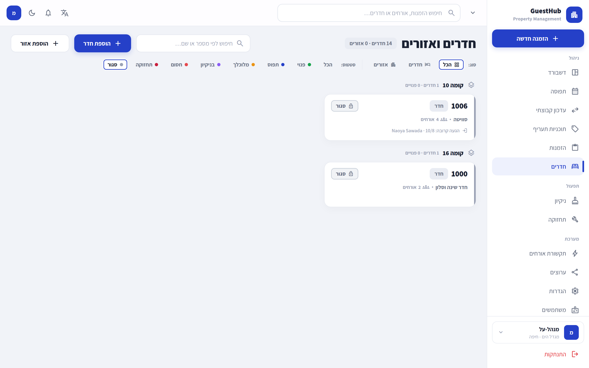
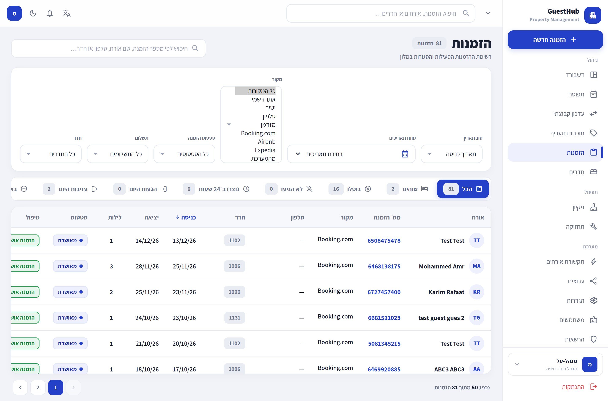
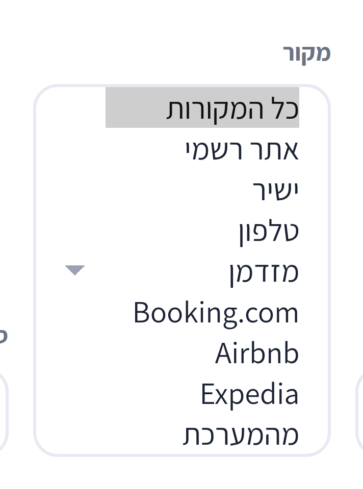
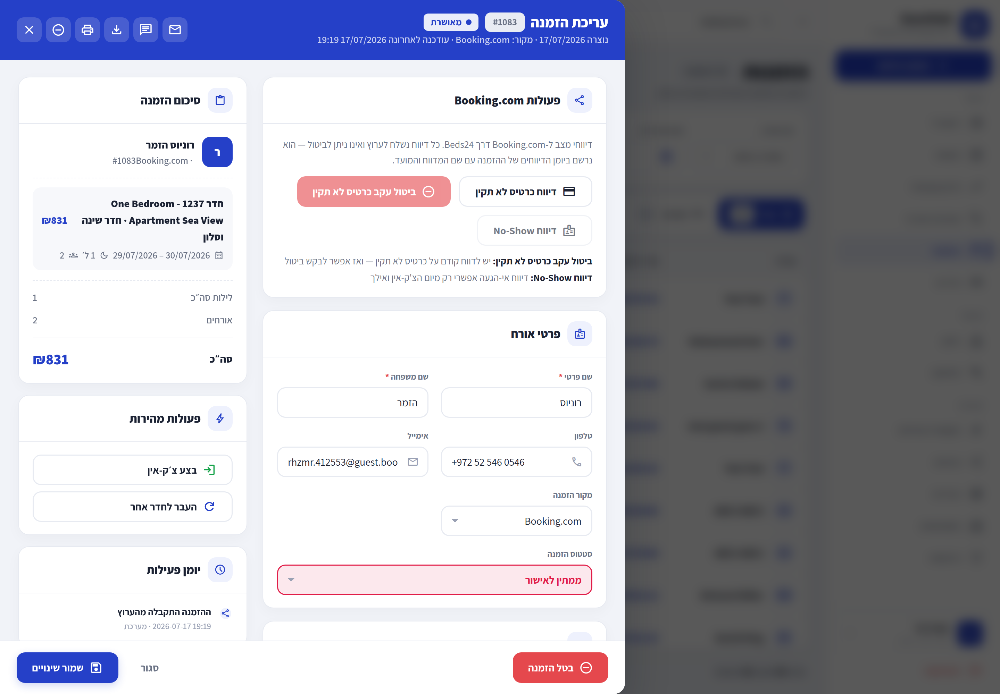
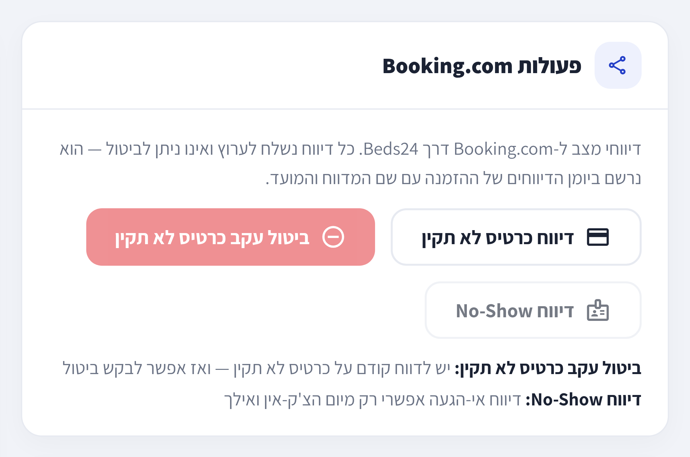

# אימות UI מול Staging — runbook

**מה זה פותר.** בליל 24/07 שלוש משימות UI נחסמו מאותה סיבה בדיוק: כל מסך יושב
מאחורי middleware של אימות, המשתנים `HYDRATION_*` לא הוגדרו, והדרך היחידה שהייתה
ידועה למינטינג session הייתה **כתיבה ל-Supabase auth של פרודקשן**. אף אחד לא יכול
היה לצלם מסך. (`docs/NIGHT_RUN_REPORT.md` שורה 126.)

המסמך הזה מקים **staging auth נפרד לחלוטין** — GoTrue משלו, JWT secret משלו,
סכמת `auth` משלו בתוך מסד ה-staging — ומוכיח אותו בשלושת צילומי המסך שחסרו.
**פרודקשן auth לא נגעה ולא נכתבה בשום שלב.**

---

## 0. הארכיטקטורה בקצרה — למה זה עבד

| שכבה | פרודקשן | Staging (מה שהוקם כאן) |
|------|----------|------------------------|
| נתוני האפליקציה | PostgreSQL, schema `guesthub` | `guesthub_staging` על `127.0.0.1:5434` (קונטיינר `guesthub-staging-db`) |
| אימות בלבד | קונטיינר `supabase-auth` (GoTrue) מאחורי `supabase-kong:8000` | קונטיינר **`guesthub-staging-auth`** (GoTrue) על `127.0.0.1:9989` |
| נתיב `/auth/v1` | Kong מקלף את הקידומת | `scripts/staging-auth-proxy.mjs` על `127.0.0.1:9990` מקלף אותה |
| JWT secret / anon / service keys | של פרודקשן | **נוצרו מחדש**, staging-only |

Supabase כאן הוא **אימות בלבד** (`src/lib/supabase/server.ts` שורה 4). כל גישה
לנתונים עוברת דרך `lib/db.ts`. לכן staging auth נפרד לא דורש שום שינוי קוד:
`getActor()` (ב-`src/lib/auth/actor.ts`) לוקח את `user.id` מה-session ומחפש
`guesthub.users WHERE auth_user_id = …`. מספיק שה-**id** של משתמש ה-staging auth
יהיה זהה ל-`auth_user_id` שכבר קיים בשורת המשתמש ב-`guesthub_staging`.

---

## 1. משתני `HYDRATION_*` — הרשימה המלאה

בדוק על **כל** ה-refs (`git grep -E "HYDRATION_[A-Z_]+" $(git for-each-ref --format='%(refname)' refs/remotes/origin refs/heads)`).
קיימים שלושה, לא יותר:

| משתנה | חובה? | מה הוא עושה | היכן נקרא |
|-------|--------|--------------|------------|
| `HYDRATION_BASE_URL` | **כן** | ה-origin של האפליקציה שנטענת בדפדפן, למשל `http://127.0.0.1:3017`. גם מקור ה-`domain` של עוגיית ה-session. | `scripts/check-hydration-browser.mjs:25` · `scripts/staging-screenshot.mjs` |
| `HYDRATION_EMAIL` | **כן** | האימייל של משתמש הבדיקה שמולו מבוצע `grant_type=password`. | `scripts/check-hydration-browser.mjs:26` · `scripts/staging-screenshot.mjs` |
| `HYDRATION_PASSWORD` | **כן** | הסיסמה של אותו משתמש. | `scripts/check-hydration-browser.mjs:27` · `scripts/staging-screenshot.mjs` |

שלושתם נבדקים fail-closed בלולאה אחת (`check-hydration-browser.mjs:33-35`) יחד עם
שני משתני הסביבה הרגילים של האפליקציה, שגם הם חובה לאותם סקריפטים:

| משתנה נלווה | חובה? | תפקיד |
|--------------|--------|--------|
| `NEXT_PUBLIC_SUPABASE_URL` | **כן** | בסיס ה-URL של GoTrue. הסקריפטים מרכיבים ממנו `${URL}/auth/v1/token?grant_type=password`, וגם גוזרים ממנו את **שם העוגייה**. |
| `NEXT_PUBLIC_SUPABASE_ANON_KEY` | **כן** | ה-`apikey` של קריאת ההתחברות. |
| `CHROME_BIN` | לא | ברירת מחדל `/opt/google/chrome/chrome` (קיים על השרת). |
| `CDP_PORT` | לא | ברירת מחדל `9444` ב-`check-hydration-browser`, `9455` ב-`staging-screenshot`. |

`docs/audit/ARCHITECTURE_INVENTORY.md:171` מסווג את שלושתם כ-"Test/check harness only" —
הם **לא** נקראים בשום מקום בקוד האפליקציה, רק ב-harness.

---

## 2. הקמת staging auth (חד-פעמי, ניתן לשחזור)

### 2.1 סוד ומפתחות — staging-only

```bash
node -e '
const c=require("crypto"), fs=require("fs");
const secret=c.randomBytes(48).toString("base64url");
const b64=(o)=>Buffer.from(JSON.stringify(o)).toString("base64url");
const iat=Math.floor(Date.now()/1000), exp=iat+60*60*24*365*5;
const mk=(role)=>{const h=b64({alg:"HS256",typ:"JWT"});const p=b64({iss:"guesthub-staging",role,iat,exp});
  return h+"."+p+"."+c.createHmac("sha256",secret).update(h+"."+p).digest("base64url");};
fs.writeFileSync("staging-auth.secrets.env",
  `STAGING_GOTRUE_JWT_SECRET=${secret}\nSTAGING_ANON_KEY=${mk("anon")}\nSTAGING_SERVICE_ROLE_KEY=${mk("service_role")}\n`,{mode:0o600});
'
```

anon ו-service_role של Supabase הם פשוט JWT חתומים ב-HS256 עם `role` ב-payload.
המפתחות האלה **לא קשורים** למפתחות פרודקשן ואינם מקבלים גישה אליהם.

### 2.2 סכמת `auth` במסד ה-staging

GoTrue לא יוצר את הסכמה בעצמו — בלעדיה הוא נופל עם
`no schema has been selected to create in (SQLSTATE 3F000)`:

```bash
set -a; . /var/www/guesthub/.env.staging; set +a
psql "$STAGING_DATABASE_URL" -v ON_ERROR_STOP=1 -c \
  "CREATE SCHEMA IF NOT EXISTS auth AUTHORIZATION supabase_admin;
   GRANT USAGE ON SCHEMA auth TO supabase_auth_admin, authenticated, anon, service_role;"
```

### 2.3 קונטיינר GoTrue

הקונטיינר מדבר עם `guesthub-staging-db` דרך ה-IP שלו ברשת ה-`bridge`
(`docker inspect guesthub-staging-db --format '{{.NetworkSettings.Networks.bridge.IPAddress}}'`;
ברשת bridge ברירת המחדל אין DNS פנימי לפי שם). הפורט נחשף **ל-loopback בלבד**.

```bash
set -a; . /var/www/guesthub/.env.staging; . ./staging-auth.secrets.env; set +a
GOTRUE_DB=$(node -e 'const u=new URL(process.env.STAGING_DATABASE_URL);
  u.hostname="172.17.0.2"; u.port="5432"; u.search="?search_path=auth&sslmode=disable";
  console.log(u.toString())')

docker run -d --name guesthub-staging-auth --restart unless-stopped \
  -p 127.0.0.1:9989:9999 \
  -e GOTRUE_DB_DRIVER=postgres -e GOTRUE_DB_DATABASE_URL="$GOTRUE_DB" \
  -e GOTRUE_API_HOST=0.0.0.0 -e PORT=9999 \
  -e API_EXTERNAL_URL=http://127.0.0.1:9990 \
  -e GOTRUE_SITE_URL=http://127.0.0.1:3017 \
  -e GOTRUE_URI_ALLOW_LIST='http://127.0.0.1:3017,http://localhost:3017' \
  -e GOTRUE_JWT_SECRET="$STAGING_GOTRUE_JWT_SECRET" \
  -e GOTRUE_JWT_EXP=3600 -e GOTRUE_JWT_AUD=authenticated \
  -e GOTRUE_JWT_DEFAULT_GROUP_NAME=authenticated -e GOTRUE_JWT_ADMIN_ROLES=service_role \
  -e GOTRUE_DISABLE_SIGNUP=true -e GOTRUE_EXTERNAL_EMAIL_ENABLED=true \
  -e GOTRUE_MAILER_AUTOCONFIRM=true \
  -e GOTRUE_SMTP_HOST=localhost -e GOTRUE_SMTP_PORT=2500 \
  -e GOTRUE_SMTP_ADMIN_EMAIL=noreply@staging.local \
  supabase/gotrue:v2.186.0

curl -s http://127.0.0.1:9989/health   # {"version":"v2.186.0","name":"GoTrue",…}
```

`GOTRUE_DISABLE_SIGNUP=true` — אין הרשמה עצמית; משתמשים נוצרים רק דרך admin API
עם ה-service key. `GOTRUE_MAILER_AUTOCONFIRM=true` — אין SMTP אמיתי ב-staging.

### 2.4 ה-shim של `/auth/v1`

supabase-js מקודד קשיח `${NEXT_PUBLIC_SUPABASE_URL}/auth/v1/…`. בסטאק המלא Kong
מקלף את הקידומת; ב-staging אין Kong. `scripts/staging-auth-proxy.mjs` הוא בדיוק
40 השורות החסרות, והוא מסרב לכל upstream שאינו loopback:

```bash
STAGING_AUTH_UPSTREAM=http://127.0.0.1:9989 STAGING_AUTH_PROXY_PORT=9990 \
  node scripts/staging-auth-proxy.mjs &
curl -s http://127.0.0.1:9990/auth/v1/health
```

---

## 3. משתמש הבדיקה — ב-staging auth בלבד

הטריק שמייתר כל כתיבה ל-`guesthub.users`: GoTrue v2.186 מקבל `id` מפורש
ב-`POST /admin/users`. לכן יוצרים את משתמש ה-auth עם **אותו UUID** שכבר רשום
ב-`guesthub_staging.guesthub.users.auth_user_id`, והשורה הקיימת "נדלקת" כמו שהיא.

```bash
psql "$STAGING_DATABASE_URL" -tAc \
  "SELECT u.email, u.auth_user_id, r.key
     FROM guesthub.users u LEFT JOIN guesthub.roles r ON r.id = u.role_id
    WHERE u.is_active ORDER BY r.key"
# admin@ginot.co.il | f9b3a503-2959-4af7-8f71-ac2cbdafea51 | super_admin

PW="Stg!$(openssl rand -base64 12 | tr -d '/+=')"
curl -s -X POST http://127.0.0.1:9990/auth/v1/admin/users \
  -H "apikey: $STAGING_SERVICE_ROLE_KEY" -H "Authorization: Bearer $STAGING_SERVICE_ROLE_KEY" \
  -H 'Content-Type: application/json' \
  -d "{\"id\":\"f9b3a503-2959-4af7-8f71-ac2cbdafea51\",
       \"email\":\"admin@ginot.co.il\",\"password\":\"$PW\",\"email_confirm\":true}"
```

אימות מיידי (חייב להחזיר `access_token`):

```bash
curl -s -X POST "http://127.0.0.1:9990/auth/v1/token?grant_type=password" \
  -H "apikey: $STAGING_ANON_KEY" -H 'Content-Type: application/json' \
  -d "{\"email\":\"admin@ginot.co.il\",\"password\":\"$PW\"}"
```

> הסיסמה נשמרת מחוץ לריפו (scratchpad, `chmod 600`). היא תקפה **רק** מול
> `guesthub-staging-auth`; היא חסרת משמעות מול פרודקשן.

**אפס כתיבות ל-`guesthub.users`.** ה-super_admin שכבר היה בזרע ה-staging הוא
המשתמש שנכנס.

---

## 4. הזרקת session — שם העוגייה, המבנה, האימות

`@supabase/ssr` שומר את כל אובייקט ה-session בעוגייה אחת:

* **שם** — `sb-<ref>-auth-token`, כאשר `<ref>` הוא ה-label הראשון של ה-host ב-`NEXT_PUBLIC_SUPABASE_URL`.
  ב-staging ה-host הוא `127.0.0.1:9990`, כלומר `<ref> = "127"` → **`sb-127-auth-token`**.
  נראה מוזר, אבל זה בדיוק מה שהלקוח בדפדפן מחשב — וזה מה שקובע.
* **ערך** — `base64-` + `base64(JSON.stringify(session))`, כאשר `session` הוא גוף
  התשובה המלא של `token?grant_type=password`.
* **פיצול** — מעל 3180 תווים הערך נחתך ל-`sb-<ref>-auth-token.0`, `.1`, …
* **domain / path** — ה-hostname של `HYDRATION_BASE_URL`, `path=/`.

הכל ממומש ב-`scripts/staging-screenshot.mjs` (זהה בכוונה ל-`check-hydration-browser.mjs`
כדי ששני ה-harness יתנהגו אותו דבר). העוגייה מוזרקת דרך CDP `Network.setCookie`.

**האימות שה-session באמת נתפס** — ה-middleware מפנה **כל** בקשה לא-מאומתת ל-`/login`
(`src/middleware.ts:61`). לכן הסקריפט קובע:

```js
assert.notEqual(await evalJs("location.pathname"), "/login",
  "NOT AUTHENTICATED — the app redirected to /login");
```

נחיתה על הנתיב המבוקש **היא** ההוכחה. בנוסף הסקריפט אוכף
`document.documentElement.dir === "rtl"` ונוכחות תווים עבריים — כך ש-RTL נאמד
ולא "נראה בעין".

---

## 5. הרצת האפליקציה מול staging

`.env.local` בעץ העבודה (ב-`.gitignore`, לא נכנס לריפו) — **שמות בלבד**:

```
NEXT_PUBLIC_SUPABASE_URL=http://127.0.0.1:9990
NEXT_PUBLIC_SUPABASE_ANON_KEY=<STAGING_ANON_KEY>
SUPABASE_SERVICE_ROLE_KEY=<STAGING_SERVICE_ROLE_KEY>
SUPABASE_ADMIN_URL=http://127.0.0.1:9990
DATABASE_URL=<STAGING_APP_URL מתוך /var/www/guesthub/.env.staging>
NEXT_PUBLIC_APP_URL=http://127.0.0.1:3017
APP_PORT=3017
CARD_VAULT_KEY / CHANNEL_SECRETS_KEY / MESSAGING_SECRETS_ENCRYPTION_KEY  # נוצרו מחדש ל-staging
```

שלושת מפתחות ההצפנה נוצרו **חדשים** בכוונה: אסור להעתיק מפתחות פרודקשן לעץ
עבודה. המחיר הידוע — שתי שורות `reservation_cards` ב-staging הוצפנו במפתח אחר
ולא ייקראו; אף אחד מהמסכים במסמך הזה לא נוגע בהן.

```bash
git worktree add /var/www/wt-uiverify -b <branch> origin/main
cd /var/www/wt-uiverify && pnpm install --frozen-lockfile
pnpm build
PORT=3017 npx next start -p 3017 &        # פורט 3007 שייך לפרודקשן — לא לגעת
curl -s -o /dev/null -w '%{http_code} %{redirect_url}\n' http://127.0.0.1:3017/
# 307 http://127.0.0.1:3017/login  ← נכון: ללא session ה-middleware מפנה
```

מיגרציות ל-staging (`migrate.mjs` מסרב ל-`:5432` המקומי — הפולר של פרודקשן):

```bash
MIGRATE_DATABASE_URL="$STAGING_DATABASE_URL" node scripts/db/migrate.mjs --status
MIGRATE_DATABASE_URL="$STAGING_DATABASE_URL" node scripts/db/migrate.mjs --apply
```

---

## 6. צילום מסך מאומת

```bash
HYDRATION_BASE_URL=http://127.0.0.1:3017 \
HYDRATION_EMAIL=admin@ginot.co.il HYDRATION_PASSWORD='…' \
node --experimental-websocket --env-file=.env.local scripts/staging-screenshot.mjs \
  --url /rooms --out docs/screenshots/01-rooms-closed-state.png \
  --wait-text "חדרים ואזורים" --width 1440 --height 900 \
  --script '<JS שרץ בדף לפני הצילום>' \
  --clip '<CSS selector לחיתוך>'
```

הסקריפט **מסרב לרוץ** אם `HYDRATION_BASE_URL` או `NEXT_PUBLIC_SUPABASE_URL`
אינם loopback — הוא לא יכול להתחבר לפרודקשן גם בטעות.

---

## 7. ההוכחה — שלושת צילומי המסך שחסרו

כל הצילומים: Chrome headless, `deviceScaleFactor=2`, `TZ` של הדפדפן `Asia/Jerusalem`,
בנייה **פרודקשן** (`next build` + `next start`) של מיזוג מקומי של שלושת ענפי הלילה
(#108 + #109 + #110). המיזוג המקומי **לא נדחף ולא מוזג ל-main**.

בכל שלושת הצילומים נאכף אוטומטית `<html dir="rtl" lang="he">` ונוכחות עברית —
והם אכן נראים RTL: הסיידבר מימין, כותרות וטבלאות מיושרות לימין, מספרים ותאריכים
בכיווניות LTR מקומית בתוך זרימה RTL.

### א. מצב "סגור" בעמוד החדרים (#108)



`/rooms` עם מסנן הסטטוס **סגור** פעיל. חדרים 1006 ו-1000 מציגים צ'יפ `סגור`
עם אייקון מנעול. הנתון האמיתי: `guesthub.pricing_plan_rates.stop_sell = true`
לתאריך הלוח על תוכנית הבסיס של אותם חדרים (זריעת staging, §8).

### ב. dropdown מקור ההזמנה (#109)



תקריב: 

`/reservations`, שדה **מקור**. הרשימה מונעת-DB לגמרי
(`lookup_items(category='booking_sources')`), ולכן מיגרציה 056 **היא** הפיצ'ר:
`מהמערכת` מופיע בסוף הרשימה, אחרי `Expedia`, בדיוק כפי ש-056 מתכננת
(`MAX(sort_order)+1`).

> אופן הצילום, לגילוי מלא: זהו `<select>` נייטיב, וה-popup שלו מצויר ע"י מערכת
> ההפעלה ולא נכנס ל-screenshot של CDP. לפני הצילום הוצב `select.size = options.length`
> כך שאותן אופציות עצמן נפרשות בתוך ה-DOM. **לא נוסף ולא שונה שום טקסט** — זו
> אותה רשימה שה-DOM מחזיק.

### ג. סרגל הפעולות של Booking.com (#110)



תקריב: 

הזמנה `#1083`, מקור Booking.com, כניסה 29/07/2026 — נפתחה בפאנל הצד. הכרטיס
**פעולות Booking.com** מציג את שלוש הפעולות במצבן האמיתי לתאריך 25/07/2026:

| פעולה | מצב | הסיבה שמוצגת |
|-------|------|---------------|
| `דיווח כרטיס לא תקין` | פעיל | החלון פתוח עד תחילת יום הצ'ק-אין |
| `ביטול עקב כרטיס לא תקין` | מושבת | «יש לדווח קודם על כרטיס לא תקין» |
| `דיווח No-Show` | מושבת | «דיווח אי-הגעה אפשרי רק מיום הצ'ק-אין ואילך» |

הנתונים בפאנל הם נתוני **בדיקה** של staging: שמות סינתטיים וכתובות alias של
Booking.com (`…@guest.booking.com`). אין בצילום שום סוד, אין מפתח, ואין נתוני
כרטיס — כרטיס האשראי לא נפתח.

זה בדיוק החוזה של `windowRejection()` ב-`src/lib/channel/booking-com-report-rules.ts`,
ושתי הסיבות מוצגות גם כטקסט מתחת לכפתורים (tooltip אינו נגיש במגע).
**שום דיווח לא נשלח** — הצילום מפסיק לפני כל קליק.

---

## 8. זריעת נתוני staging שנעשתה

כתיבות ל-staging בלבד, כולן additive; **אף שורה לא נמחקה**:

1. **מיגרציה 056** (`056_source_system.sql`) הוחלה על `guesthub_staging`
   (055 כבר הייתה מוחלת). זרעה `lookup_items(booking_sources,'system','מהמערכת')`.
2. **`stop_sell` לתאריך הלוח** על תוכניות הבסיס של חדרים 1000 ו-1006:

```sql
INSERT INTO guesthub.pricing_plan_rates
  (tenant_id, sellable_unit_id, pricing_plan_id, date, price, stop_sell)
SELECT pp.tenant_id, pp.sellable_unit_id, pp.id, CURRENT_DATE, 450.00, true
FROM guesthub.sellable_unit_rooms sur
JOIN guesthub.pricing_plans pp
  ON pp.sellable_unit_id = sur.sellable_unit_id AND pp.tenant_id = sur.tenant_id
 AND pp.is_base AND pp.is_active
JOIN guesthub.rooms r ON r.id = sur.room_id
WHERE r.room_number IN ('1000','1006')
ON CONFLICT (pricing_plan_id, date) DO UPDATE SET stop_sell = true, updated_at = now();
```

3. **הזמנת Booking.com** — לא נדרשה זריעה. ל-staging כבר יש הזמנות עם
   `ota_name='BookingCom'` ו-`external_booking_id`; נבחרה `#1083` כי הצ'ק-אין
   שלה עתידי, ולכן הכרטיס מציג גם פעולה פעילה וגם שתי פעולות חסומות.

---

## 9. כיבוי / הרמה מחדש

```bash
pkill -f staging-auth-proxy.mjs
pkill -f "next start -p 3017"
docker stop guesthub-staging-auth        # docker start … כדי להרים בחזרה
```

הקונטיינר `guesthub-staging-auth` הוא `--restart unless-stopped` ושורד reboot.
סכמת ה-`auth` וה-JWT secret נשארים, ולכן משתמש הבדיקה ממשיך לעבוד.
`guesthub-staging-db` לא הופעל ולא כובה ע"י התהליך הזה.

---

## 10. המצב החי כרגע (למי שממשיך)

| מה | מצב |
|-----|------|
| `guesthub-staging-auth` (GoTrue, `127.0.0.1:9989`) | **רץ**, `--restart unless-stopped` |
| `staging-auth-proxy.mjs` (`127.0.0.1:9990`) | **רץ** (מנותק, PPID 1). מת ב-reboot — הרם מחדש לפי §2.4 |
| שרת האפליקציה על `127.0.0.1:3017` | **כובה** בסיום. הרם מחדש לפי §5 |
| `guesthub-staging-db` | לא הופעל ולא כובה על ידי התהליך הזה |

`/var/www/wt-uiverify/.env.local` (ב-`.gitignore`, `chmod 600`) כבר מכיל את
**כל** מה שה-harness צריך — כולל `HYDRATION_BASE_URL` / `HYDRATION_EMAIL` /
`HYDRATION_PASSWORD`. לכן צילום נוסף הוא שורה אחת:

```bash
cd /var/www/wt-uiverify && PORT=3017 npx next start -p 3017 &
node --experimental-websocket --env-file=.env.local scripts/staging-screenshot.mjs \
  --url /<מסך> --out docs/screenshots/<שם>.png --wait-text "<טקסט עברי מהמסך>"
```

(`--env-file` טוען את `HYDRATION_*` יחד עם השאר; אין צורך לייצא כלום ביד.)

---

## 11. מה **לא** נעשה — במכוון

* **פרודקשן auth** (`supabase-auth` / `supabase-kong:8000`) — אפס בקשות. משתמש
  הבדיקה קיים **רק** ב-`guesthub_staging.auth.users`.
* קבצי `.env` של פרודקשן — לא נערכו. `/var/www/guesthub/.env.staging` נקרא בלבד,
  לצורך ה-URLs של staging.
* `/var/www/guesthub` — לא שימש כעץ עבודה; לא הורץ בו build; לא בוצע deploy;
  `pm2 restart` לא הורץ על שום תהליך.
* ענפי הלילה #108/#109/#110 — מוזגו **מקומית בלבד**, לענף זמני, כדי לבנות ולצלם.
  לא נדחפו, ולא מוזגו ל-main.
* `package.json` ו-`DECISIONS.md` — לא נגעתי בהם: שניהם שייכים לדיף של
  `fix/beds24-checkin-cancellation-guard` (PR #112) שממתין למיזוג. לכן אין כאן
  `pnpm check:*` חדש; הפקודות במסמך הן node ישיר.
