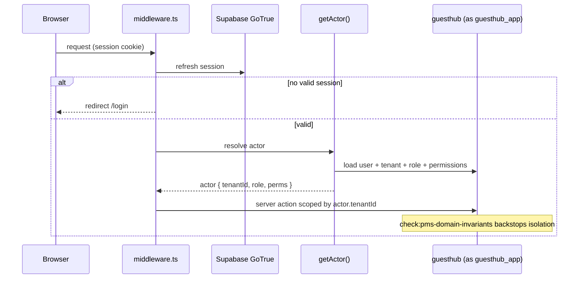

# GuestHub — Authorization & Tenancy

- **Status:** Complete — Stage 3, 2026-07-18 (verified in **Stage 6**)
- **Branch:** `feat/pms-hardening-channex-certification`
- **Sources:** `docs/audit/ARCHITECTURE_INVENTORY.md` (§5), `docs/security/THREAT_MODEL.md` (§2, Assets D/F, F2), `docs/audit/DOMAIN_INVENTORY.md` (§1, §2.1), `docs/architecture/adr/ADR-0006-tenant-isolation.md`, ADR-0002, `db/roles/roles.sql`
- **Enforced by:** `check:pms-domain-invariants`, `check:db-isolation`

Identity, session, actor resolution, RBAC, and how tenant isolation is enforced.

## 1. Identity and session

Auth is **self-hosted Supabase GoTrue** (session cookie via `@supabase/ssr`). Login accepts email **or** username (resolved to email from `guesthub.users`, active rows only), then `signInWithPassword`; errors are deliberately vague. `src/middleware.ts` refreshes the cookie and gates every non-static request, with explicit bypasses for `/auth/callback` and the token-authenticated webhook routes.

## 2. Actor resolution

The actor is resolved **server-side** in `getActor()` to a `guesthub.users` row + tenant + role + effective permissions (`THREAT_MODEL.md` §1). Every server action tenant-scopes by **`actor.tenantId`**; client-supplied tenant ids are never trusted.

## 3. RBAC model

RBAC is complete for single-property operation (migration 003): `users`, `roles`, `permissions`, `role_permissions`, and per-user `user_permission_overrides`, with 6 seeded roles. The privilege-escalation guards are pure and unit-checkable:

- **rank dominance** — you cannot act on a role that outranks yours;
- **no self role-change** — an operator cannot change their own role;
- **grant-subset** — you cannot grant a permission you do not hold yourself.

`admin` / `super_admin` bypass granular permission checks by design (a known blast-radius concern — F5, Stage 6 review).

## 4. Tenant isolation (ADR-0006)

Isolation is enforced **server-side, not by RLS**. The decision (ADR-0006) is deliberate:

1. **Canonical layer:** every data-access path scopes by `actor.tenantId` — the single source of truth for isolation.
2. **Why not RLS:** the `guesthub` schema is **not exposed via PostgREST** (`anon`/`authenticated` revoked in `000_init_schema.sql`); there is no untrusted direct DB client — the primary case RLS defends. Session-pooled connections (Supavisor) also make a per-request tenant GUC fragile. RLS would duplicate enforcement without removing the need for correct server-side scoping.
3. **Verifiable backstop (this stage):** **`check:pms-domain-invariants`** asserts against real data that no row crosses a tenant boundary — `reservation_rooms↔reservation`, `payments↔reservation`, `reservation_rooms↔room`, `reservation_cards↔reservation` all share a tenant. This turns "we always scope correctly" into a continuously-checked invariant, closing the "no backstop" part of H3.
4. **Defense in depth:** composite `(tenant_id, id)` FKs from the 026/036-era stay; new cross-tenant-referencing tables should prefer composite FKs.
5. **RLS re-evaluation trigger:** adopt RLS if the schema is ever exposed via PostgREST/GraphQL, a browser/edge client connects directly, or a less-trusted service shares the DB.

## 5. Least-privilege DB roles (ADR-0002, Stage 2)

`db/roles/roles.sql` defines four roles applied per dedicated environment:

| Role | Privilege |
|---|---|
| `guesthub_owner` | owns the schema + all objects; runs migrations/DDL |
| **`guesthub_app`** | **runtime DML only** (SELECT/INSERT/UPDATE/DELETE + EXECUTE); owns nothing; cannot DDL; `CREATE` on schema revoked |
| `guesthub_readonly` | SELECT-only diagnostics |
| `guesthub_backup` | `pg_read_all_data` for dump/restore |

The application runtime connects as **`guesthub_app`**, the least-privilege role. Note (ADR-0006 §2): because a table owner bypasses RLS but an ordinary role does not, running as `guesthub_app` is also what would *allow* RLS to be enforced later if the trigger conditions occur.

## 6. Remaining gaps (owning stage)

- **`admin`/`super_admin` bypass all granular checks** — a compromised admin session is unbounded within its tenant (F5) — **Stage 6** red-team.
- Channel `*-admin.ts` helpers have thin local auth — confirm none is reachable unauthenticated — **Stage 6** (F5).
- **No app-layer login rate-limiting / lockout** (F3) — **Stage 3+ / Stage 6**.
- **MFA/2FA for operators** — **Stage 3+** (`PMS_GAP_MATRIX.md` §14).
- Audit read surface + grant/trigger-enforced append-only (not convention) — **Stage 3** (ADR-0001, H13).

## 7. Auth / actor-resolution sequence

