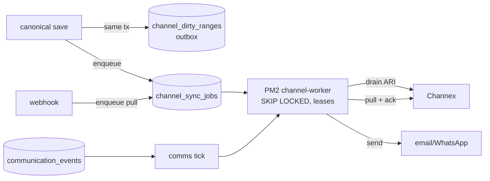

# GuestHub — Background Jobs & Queues

- **Status:** Skeleton — Stage 1; completed in **Stage 3** (queue foundations) and **Stage 4** (Channex wiring)
- **Date:** 2026-07-18
- **Branch:** `feat/pms-hardening-channex-certification`
- **Sources:** `docs/audit/WORKFLOW_INVENTORY.md` (§12–§16), `docs/audit/ARCHITECTURE_INVENTORY.md` (§3), ADR-0004

Every asynchronous path: the durable job queue, the ARI outbox, the communications outbox, the worker loop, leases, retries, and crash-safety.

## Current state

All queues are **database tables** — no Redis/broker (`ARCHITECTURE_INVENTORY.md` §3). The durable `channel_sync_jobs` queue (15 job types) is claimed with `FOR UPDATE SKIP LOCKED`, FIFO per connection (one live job per connection), 10-minute leases reclaiming crashed workers' jobs, idempotency keys, priority ordering, and retry/backoff → `dead_letter` on permanent codes or exhausted `max_attempts=8` (`WORKFLOW_INVENTORY.md` §16, `queue.ts:76`). The `channel_dirty_ranges` outbox is written transactionally by every ARI-affecting save (`markAriDirty`), coalesced, and drained only for connections `active AND outbound_sync_enabled AND NOT full_sync_required` (§12). The communications queue (`communication_events` → `communication_delivery_attempts`) runs **inside the same channel-worker tick** (`runCommunicationTick` first each tick) — the M16 coupling: a Channex incident, long full-sync, or the 300 MB memory restart delays guest emails, and vice versa (`ARCHITECTURE_INVENTORY.md` Finding #7). Wake-up is `pg_notify` on `guesthub_jobs` + 20 s poll, max 5 jobs/tick. Crash-safety is genuinely sound: durable-then-wake, ack-after-commit, persist-then-quarantine, state-replacing (not delta) ARI payloads — no job-loss path was found (`OPERATIONS_OBSERVABILITY_AUDIT.md` F11).

Gaps: if PM2 exhausts `max_restarts:10` the worker sits `errored` with jobs queued and no consumer or alert (F3); dead (`failed`) dirty ranges have no requeue path or UI (F5); quarantined revisions re-import every ~5-min poll writing a fresh error row each cycle — unbounded growth (F2); no retention/pruning on any operational table (F9); no `/api/health` and the worker has no probe (F4).

## Target state (per ADR-0004, TARGET_ARCHITECTURE.md)

- Keep the existing outbox seam as canonical; formalize and harden, do not replace (ADR-0004).
- **Worker split** so ARI sync and communications no longer share a failure domain (Stage 3, M16).
- Queue heartbeat/visibility foundations, quarantine-logging dedup, and retention/pruning policy (Stage 3 foundation, tuned Stage 6; ADR-0004 §7).
- Stage 4 builds on top: single batched sync envelope, evidence ledger with Task IDs, 429 cooldown/circuit breaker.
- Worker heartbeat staleness + dead-letter/quarantine alerts (Stage 6).

## To be completed in Stage 3/4

- [ ] Queue anatomy table (job types, priorities, idempotency keys, retry policy).
- [ ] Worker tick sequence + lease/claim semantics.
- [ ] Worker-split design (Stage 3) — separate communications from channel sync.
- [ ] Retention/pruning policy for jobs/ranges/errors/webhook-events.
- [ ] Dead-range and dead-letter requeue surface.
- [ ] Mermaid worker-queue diagram (replace seed).

