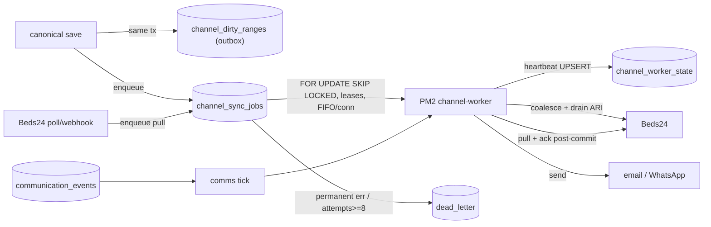

# GuestHub — Background Jobs & Queues

- **Status:** Complete — Stage 3, 2026-07-18 (queue foundations); Beds24 channel wiring continues in **Stage 4**
- **Branch:** `feat/pms-hardening-channex-certification`
- **Sources:** `docs/audit/WORKFLOW_INVENTORY.md` (§12–§16), `docs/audit/ARCHITECTURE_INVENTORY.md` (§3), `docs/audit/OPERATIONS_OBSERVABILITY_AUDIT.md`, ADR-0004, `src/lib/channel/queue.ts`, `src/lib/channel/worker.ts`
- **Enforced by:** `check:background-job-recovery`, `check:channel-worker`

Every asynchronous path: the durable job queue, the ARI outbox, the communications outbox, the worker loop, leases, retries, and crash-safety.

## 1. Queues are database tables

There is no Redis or external broker — all queues are Postgres tables (`ARCHITECTURE_INVENTORY.md` §3). This keeps the "durable-then-wake" and "ack-after-commit" properties inside one transactional store.

## 2. The durable job queue — `channel_sync_jobs`

Claim semantics (`src/lib/channel/queue.ts`):

- **`FOR UPDATE SKIP LOCKED`** — concurrent claimers never block each other.
- **FIFO per connection, one live job per connection** — ordering is preserved without a global lock.
- **10-minute leases** — a job held by a crashed worker is reclaimable once its lease expires; without the lease the FIFO guard would wedge the connection permanently.
- **Idempotency keys** on enqueue — the same logical job is not queued twice.
- **Priority ordering** and **retry/backoff** — a job moves to `retry_wait` on transient failure; a **permanent** error code or exhausted `max_attempts` (=8) moves it to **`dead_letter`**.

## 3. The ARI outbox — `channel_dirty_ranges` (ADR-0004)

Every canonical ARI-affecting save writes `channel_dirty_ranges` **in the same transaction** via `markAriDirty` — this transactional marking is the **only** way an ARI change enters the outbox (no save handler calls Beds24 directly). Ranges are coalesced and drained only for connections that are `active AND outbound_sync_enabled AND NOT full_sync_required`. Batching/coalescing lives in the drain, not the producer, so many dirty rows collapse into one envelope.

## 4. The communications outbox

`communication_events` → `communication_delivery_attempts` is an analogous events→deliveries queue. Wake-up across queues is `pg_notify` on `guesthub_jobs` + a 20 s poll, max 5 jobs per tick.

## 5. Worker loop and heartbeat

The PM2 `channel-worker` (`src/lib/channel/worker.ts`) claims with `FOR UPDATE SKIP LOCKED`, refuses to run two jobs for one connection, and writes a **heartbeat** to **`channel_worker_state`** each tick (`worker_id`, `beat_at`, `last_drain_at`, `last_error`) via UPSERT — a heartbeat failure never kills the worker. This gives Stage-6 monitoring a staleness signal. `check:background-job-recovery` proves lease reclaim, dead-letter routing, and no-job-loss.

Crash-safety is genuinely sound: durable-then-wake, ack-after-commit, persist-then-quarantine, and **state-replacing (not delta) ARI payloads** — no job-loss path was found (`OPERATIONS_OBSERVABILITY_AUDIT.md` F11).

## 6. Remaining gaps (owning stage)

- **Shared failure domain (M16):** communications run in the same worker tick as channel sync (`runCommunicationTick` first each tick), so a Beds24 incident or a long full-sync delays guest emails and vice versa. **Worker split** is owned by **Stage 3+**.
- If PM2 exhausts `max_restarts:10` the worker sits `errored` with jobs queued and no consumer/alert (F3) — **Stage 6** alerting.
- Dead (`failed`) dirty ranges and dead-letter jobs have no requeue surface (F5) — **Stage 3/6**.
- Quarantined revisions re-import every poll, writing a fresh error row each cycle (unbounded growth, F2); no retention/pruning on any operational table (F9) — **Stage 3 foundation, tuned Stage 6** (ADR-0004 §7).
- No `/api/health` and no worker probe (F4) — **Stage 6**.

## 7. Queue / worker diagram

