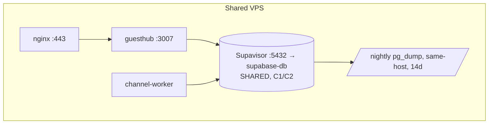

# GuestHub — Deployment

- **Status:** Skeleton — Stage 1; DB-topology parts completed in **Stage 2**, finalized in **Stage 7**
- **Date:** 2026-07-18
- **Branch:** `feat/pms-hardening-channex-certification`
- **Sources:** `docs/audit/ARCHITECTURE_INVENTORY.md` (§1, §2, §10, §11), `docs/audit/WORKFLOW_INVENTORY.md` (§17), ADR-0002

Runtime topology, database topology, the fail-closed deploy pipeline, and nginx exposure.

## Current state

Both the web app (`guesthub`, `:3007`) and the channel worker (`guesthub-channel-worker`, declared in `ecosystem.config.cjs`, fork mode, `max_memory_restart 300M`, `max_restarts 10`) run under PM2 from `/var/www/guesthub-production`; the web app is deliberately not declared in the ecosystem file and is restarted by name so its PM2 registration is never rewritten (`ARCHITECTURE_INVENTORY.md` §1). Data lives in a **shared** self-hosted Supabase Postgres (`supabase-db`, Supavisor `:5432`, schema `guesthub`) — **dev and prod share this DB (Critical C1)** — and the pooler/Kong/test-DB are internet-reachable because Docker publishing bypasses UFW with an empty `DOCKER-USER` chain (**Critical C2**) (`ARCHITECTURE_INVENTORY.md` §2, Findings #1–#2, §11). Deploy is three fail-closed layers: `prebuild-guard.mjs` (marked prod checkout refuses build without `PROD_DEPLOY_OK=1`), `production-deploy-guard.mjs` (clean tree, HEAD reachable from `origin/main`, on main, no migrations outside the approved release), and `deploy-production.sh` (fetch → guard → `merge --ff-only` → guard → build incl. `dist/worker` → PM2 restart both → verify cwd/uptime/port/routes/BUILD_ID) (`ARCHITECTURE_INVENTORY.md` §10, `WORKFLOW_INVENTORY.md` §17). Migrations are applied manually with **no migration ledger**, a duplicate `009_` prefix, and missing `021` (Findings #1, #3). Backups are nightly schema-only `pg_dump` (omits `auth` — restore loses logins, #4), unencrypted, same-host, no off-host copy (#5). nginx `guesthub.bios.co.il` proxies to `:3007` with no HSTS/security headers (#12).

## Target state (per ADR-0002, TARGET_ARCHITECTURE.md §3)

- **Dedicated per-environment Postgres clusters** (Production; Certification/Staging) + per-environment GoTrue, localhost/app-network bound (no `0.0.0.0`), reusing the disposable test DB (`:5433`) — structurally resolving C1 (ADR-0002).
- Four least-privilege roles (`guesthub_owner`/`_app`/`_readonly`/`_backup`) (ADR-0002).
- Migration ledger + replay-from-zero + recovery of migration 021 + data-copy/checksum/smoke/rollback tooling + cutover runbook — **cutover not executed** (Stage 2, `TARGET_ARCHITECTURE.md` §3).
- Backups include the `auth` schema, encrypted, retained, off-host, restore-tested (ADR-0002; Stage 6 monitoring).
- DB exposure hardening (C2) and edge security headers — Stage 6.
- Stage 7 finalizes the deployment doc + fresh-clone setup proof (no merge, no deploy, no cutover).

## To be completed in Stage 2 (DB) and Stage 7 (final)

- [ ] Dedicated-cluster provisioning topology + GoTrue-per-environment (Stage 2).
- [ ] Least-privilege role matrix (Stage 2).
- [ ] Migration-ledger + replay-from-zero + cutover runbook (Stage 2, cutover NOT executed).
- [ ] Backup/restore topology incl. `auth` schema + off-host + encryption (Stage 2 design, Stage 6 monitoring).
- [ ] Final deployment pipeline + fresh-clone setup proof (Stage 7).
- [ ] Deployment diagram (replace seed).

