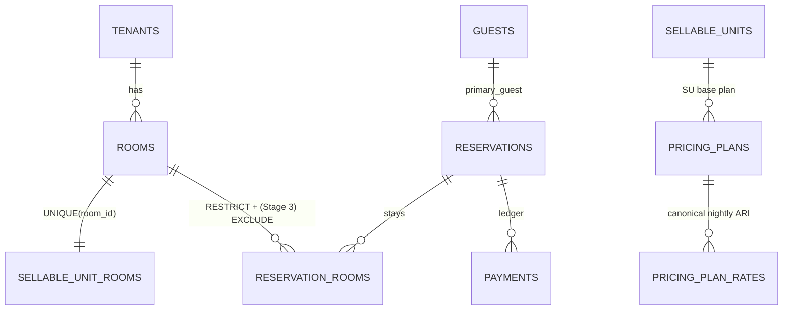

# GuestHub — Domain Model

- **Status:** Skeleton — Stage 1; completed in **Stage 3**
- **Date:** 2026-07-18
- **Branch:** `feat/pms-hardening-channex-certification`
- **Sources:** `docs/audit/DOMAIN_INVENTORY.md`, `docs/architecture/adr/ADR-0001-canonical-sources-of-truth.md`, ADR-0003, ADR-0005

Canonical entities, their relationships, and which table/function owns each business concept. This document is the reader-facing companion to the raw `DOMAIN_INVENTORY.md` and the enforcement contract in ADR-0001.

## Current state

The `guesthub` schema is a single isolated schema created by `000_init_schema.sql`; every business table carries `tenant_id NOT NULL` but only the newest tables (026, 036) use composite tenant-safe FKs — older children rely on app discipline, and there is **zero RLS** (`DOMAIN_INVENTORY.md` §1, Finding #5). The canonical commercial spine is: `rooms` (physical identity, D74/028, mirror trigger), `sellable_units`/`sellable_unit_rooms` (1:1 with rooms today), `pricing_plans` (dual-scope, 016) → `pricing_plan_rates` (6,633 rows, the canonical nightly ARI store that replaced legacy `rates`), `reservations` → `reservation_rooms` (per-room stays with immutable `pricing_snapshot`, 017), `guests`, and the `payments` ledger (`paid_amount`/`balance` are derived caches, 019) (`DOMAIN_INVENTORY.md` §2).

The audit found real modeling debt the Stage-3 work must resolve: **no DB-level double-booking guard** — zero exclusion constraints, prevention is purely `lockRooms` + `check_room_availability` (`DOMAIN_INVENTORY.md` §5, Finding #1); **`reservations.status` has no CHECK constraint** although it drives inventory via `inventory_blocking_statuses()` (Finding #2); competing/dead models — legacy `rates` (0 rows, one live read at `rooms/actions.ts:463`), four channel-mapping tables across two generations (two permanently empty but still FK-referenced), the `sellable_units_backup_028` orphan, and the triple room/SU/room_type identity kept consistent only by two triggers (Findings #4, #6, #9; §4). Duplicate FKs on `outbound_messages` (020 SET NULL vs 036 RESTRICT) silently block hard-deleting messaged guests (Finding #7).

## Target state (per ADR-0001, ADR-0003, ADR-0005)

- Declared canonical source per concept enforced by `check:pms-domain-invariants`; second paths removed or made thin projections (ADR-0001 table).
- DB-level exclusion constraint on `reservation_rooms (room_id, daterange)` scoped to blocking status + `btree_gist`, added `NOT VALID` then validated (ADR-0003).
- `reservations.status` CHECK + generated blocking-status column landing together with the exclusion constraint (ADR-0003).
- Canonical guest record + immutable per-reservation snapshot + deterministic import dedup seam; reconcile the M13 `outbound_messages` FK so guests can be anonymized (ADR-0005).
- Dead paths removed: legacy `rates`, `sellable_units_backup_028`, 005-era mapping tables (after FK migration).

## To be completed in Stage 3

- [ ] Final canonical-entity catalog with owning module per entity (from ADR-0001).
- [ ] Documented aggregate boundaries (reservation aggregate = reservation + rooms + payments + card + snapshot).
- [ ] Status model + blocking-status derivation, referencing the new CHECK + generated column.
- [ ] Guest two-layer model (canonical + snapshot) diagram and dedup-key rule.
- [ ] List of removed/converted legacy models with migration references.
- [ ] Refined ER diagram (replace seed below).

