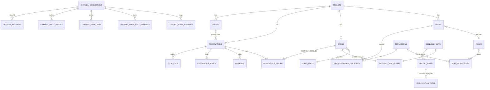

# GuestHub — Domain Model

- **Status:** Complete — Stage 3, 2026-07-18
- **Branch:** `feat/pms-hardening-channex-certification`
- **Sources:** `docs/audit/DOMAIN_INVENTORY.md`, `docs/architecture/adr/ADR-0001-canonical-sources-of-truth.md`, ADR-0003, ADR-0005, ADR-0006
- **Enforced by:** `check:pms-domain-invariants`

The canonical entities of the `guesthub` schema, their relationships, and which table or function owns each business concept. This is the reader-facing companion to the raw `DOMAIN_INVENTORY.md` and to the enforcement contract in ADR-0001.

## 1. Schema and migration ledger

The whole product lives in one isolated Postgres schema, `guesthub`, created by `000_init_schema.sql`. It is **not exposed through PostgREST** — `anon`/`authenticated` are revoked and all access is server-side through the porsager `postgres` driver (see ADR-0006 and `AUTHORIZATION_AND_TENANCY.md`). Every business table carries `tenant_id NOT NULL`.

Schema evolution is tracked by **`guesthub.schema_migrations`**, applied strictly in order by `scripts/db/migrate.mjs` from **`db/migrations/manifest.txt`** — **39 migration files** through `037_double_booking_guard.sql`. The manifest, not the directory listing, is the source of apply-order truth.

## 2. Canonical sources (ADR-0001)

Exactly one source of truth per concept; any second path is a thin projection or is slated for removal:

| Concept | Canonical source | Notes |
|---|---|---|
| Physical room identity | `rooms` (D74, migration 028) | `sellable_units` and `room_types` are projections kept 1:1 by mirror triggers (026/028). |
| Availability / conflict | `guesthub.check_room_availability()` + `src/lib/inventory.ts` | See `INVENTORY_AND_AVAILABILITY.md`. |
| Price / quote | `calculateReservationPrice` / `calculateQuote` (`src/lib/pricing/engine.ts`) | Canonical nightly ARI store is `pricing_plan_rates`. |
| Restrictions | `stayRestrictionViolationStructured` (`src/lib/rates/rules.ts`) | Min-stay is dual (arrival + through). |
| Reservation state | `reservations` + `reservation_rooms`; status ∈ CHECK set (037) | `paid_amount`/`balance` are derived caches only. |
| Payment state / balance | `guesthub.payments` ledger; `recomputePaymentAggregates` | See `PAYMENTS_AND_LEDGER.md`. |
| Guest identity | `guests` (canonical) + immutable per-reservation snapshot (ADR-0005) | Import gets a dedup/merge seam. |
| Channel mapping | live `channel_room_mappings`, `channel_room_rate_mappings` | 005-era 0-row tables are dead; consolidation is Stage 4. |
| Audit trail | `audit_logs` (append-only) via `audit-write.ts` | — |

## 3. The reservation aggregate

The transactional consistency boundary is the **reservation aggregate**: `reservations` (the root) + its `reservation_rooms` (per-room stays, each carrying an immutable `pricing_snapshot` from migration 017) + its `payments` ledger rows + its optional `reservation_cards` vault row + the policy/guest snapshots. Every create/edit/reschedule/cancel path mutates the whole aggregate inside one `sql.begin` transaction — reservation row, rooms, payment recompute, audit, and the `channel_dirty_ranges` outbox all commit atomically (see `RESERVATION_LIFECYCLE.md`).

## 4. Guest two-layer model (ADR-0005)

Guests exist in two layers: the **canonical `guests` record** (deduplicated identity, mergeable) and the **per-reservation snapshot** captured at booking time so historical reservations never mutate when a guest record is later corrected. The dedup key is deterministic (email/phone-normalized). The M13 `outbound_messages` FK was reconciled so a messaged guest can still be anonymized.

## 5. Stage-3 constraints landed

- **`reservations.status` CHECK** (037) restricts status to `draft/confirmed/checked_in/checked_out/no_show/blocked/cancelled` — a typo can no longer silently free a room.
- **`rr_no_double_booking`** exclusion constraint on `reservation_rooms` (037, ADR-0003) — the DB-level last line of defense against overlap, scoped by the trigger-maintained `is_blocking` flag. See `INVENTORY_AND_AVAILABILITY.md`.
- **Tenant-isolation invariants** are now continuously asserted by `check:pms-domain-invariants` (ADR-0006): no `reservation_rooms`, `payments`, or `reservation_cards` row may cross the tenant boundary of its parent.

## 6. Remaining modeling debt (owning stage)

- Legacy `rates` table and `sellable_units_backup_028` orphan — removal tracked (Stage 3/4 cleanup).
- 005-era channel-mapping tables — FK migration then drop (**Stage 4**).
- Retrofitting composite `(tenant_id, id)` FKs across all legacy children — larger migration, tracked not done (**Stage 3+**, ADR-0006 §3).

## 7. Entity–relationship diagram

