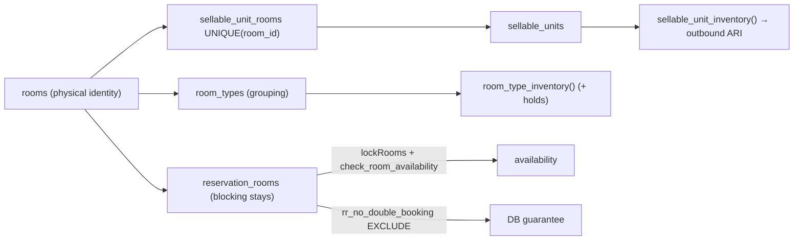

# GuestHub — Inventory & Availability

- **Status:** Complete — Stage 3, 2026-07-18
- **Branch:** `feat/pms-hardening-channex-certification`
- **Sources:** `docs/audit/RESERVATIONS_INVENTORY_AUDIT.md` (§2 Q1–Q2), `docs/audit/DOMAIN_INVENTORY.md` (§3, §5), ADR-0001, ADR-0003
- **Enforced by:** `check:inventory`, `check:inventory-integrity`, `check:reservation-concurrency`

How availability is computed, how physical inventory maps to sellable units, and where the double-booking guarantee lives.

## 1. The one conflict function

Availability has exactly one conflict-level function: SQL **`guesthub.check_room_availability()`** (`004_phase3_calendar.sql`) — half-open overlap, blocking statuses, closures, and room sellability. The sole TS entry is **`checkRoomAvailability`** (`src/lib/inventory.ts:57`). Every booking-side path reaches it: the pricing engine calls it (`engine.ts`), and OTA import / closures call it directly. The blocking-status list is single-sourced (`inventory_blocking_statuses()` ↔ `INVENTORY_BLOCKING_STATUSES` in `src/lib/inventory-rules.ts`, CI-asserted): **`confirmed`, `checked_in`, `blocked`**.

## 2. Availability computation

Inputs: the requested stay `[check_in, check_out)`, existing **blocking** `reservation_rooms` on the room, room closures, and the room's sellable/status flags. Overlap uses the **half-open interval** rule — `daterange(check_in, check_out, '[)')` — so a same-day checkout and check-in on one room do **not** collide (standard hotel night semantics). A room is available for the stay iff it is sellable, not closed, and has no overlapping blocking stay.

## 3. Physical → sellable → channel model

Inventory is three layers kept 1:1 by the 026/028 triggers:

- **`rooms`** — canonical physical identity (one bookable room).
- **`sellable_units`** (+ `sellable_unit_rooms`, `UNIQUE(room_id)`) — the sold-inventory projection; today one SU per room.
- **`room_types`** — the grouping projection used for channel room-type mapping.

Two aggregate count projections exist: `room_type_inventory()` (includes `channel_inventory_holds`) and `sellable_unit_inventory()` (deliberately excludes holds; feeds outbound ARI to Beds24).

## 4. The double-booking guarantee (ADR-0003, migration 037)

The guarantee is now enforced at **two levels**:

1. **App contract (UX + lock ordering):** `lockRooms()` (`SELECT … FOR UPDATE`, `src/lib/inventory.ts:38`) then `check_room_availability()` in the same transaction — friendly error, correct ordering.
2. **DB last line of defense:** the `rr_no_double_booking` **exclusion constraint** on `reservation_rooms`:
   ```sql
   EXCLUDE USING gist (
     room_id WITH =,
     daterange(check_in, check_out, '[)') WITH &&
   ) WHERE (is_blocking)
   ```
   `btree_gist` is enabled on the dedicated cluster (Stage 2 permits extensions there). `is_blocking` is a trigger-maintained boolean mirroring `(room_id IS NOT NULL AND parent reservation.status ∈ blocking set)`, so the partial exclusion is immutable and scoped to real inventory-consuming stays. Any writer — future app code, admin SQL, a migration script — that would create an overlap now fails closed. This closes F1/H1 and scenario R9.

## 5. Remaining gaps (owning stage)

- **`channel_inventory_holds` is dead scaffolding** — counted and rendered but never written, so an unappliable OTA booking consumes no local inventory (local-overbooking window, F2). Wire or drop — **Stage 3/4** (ADR-0001 M1).
- **`lockRooms` does not sort room ids** — cross-path multi-room writes can deadlock (F4). Deterministic lock ordering — **Stage 3+** (ADR-0003).
- **Count-projection divergence** — reconcile `room_type_inventory()` (holds included) vs `sellable_unit_inventory()` (holds excluded) once holds are resolved — **Stage 3/4**.

## 6. Mapping diagram


