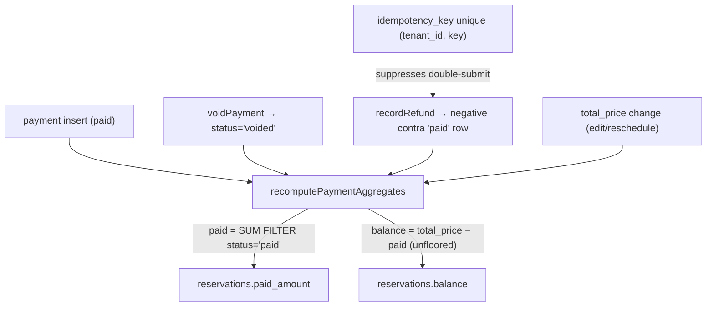

# GuestHub — Payments & Ledger

- **Status:** Complete — Stage 3, 2026-07-18
- **Branch:** `feat/pms-hardening-channex-certification`
- **Sources:** `docs/audit/PAYMENTS_AUDIT.md`, ADR-0001, `docs/security/THREAT_MODEL.md` (Asset B)
- **Enforced by:** `check:payment-ledger-integrity`, `check:payment-refund-void`, `check:timezone-and-money-invariants`

The authoritative money ledger, balance derivation, refund/void, the card-data boundary, the gateway/token seam, and idempotency.

## 1. The authoritative ledger

**`guesthub.payments`** is the authoritative money ledger (`000_init_schema.sql` + `idempotency_key` from migration 030). `reservations.paid_amount` and `reservations.balance` are explicitly **derived caches** of it, recomputed in-transaction by the single function **`recomputePaymentAggregates`** (`src/lib/payments/ledger.ts:26`):

```
paid    = SUM(amount) FILTER (WHERE status = 'paid')   -- captured funds only
balance = total_price − paid                            -- NEVER floored (negative = credit)
```

Migration 019 pinned payment status via CHECK (`paid, pending, failed, voided, refunded`) and rebuilt every cache from the ledger. Only `status = 'paid'` counts as captured money; every other status is excluded, so a failed or voided row can never inflate `paid_amount`. This single formula replaced the four divergent incremental formulas that used to let `paid_amount` drift.

## 2. Refund and void (Stage 3, H7)

Refund and void are now implemented as the **only sanctioned money-reversal paths** (`src/lib/payments/mutations.ts`), both operating inside the caller's transaction so the ledger write and the aggregate recompute commit atomically:

- **`voidPayment`** — flips a mistaken capture to `status = 'voided'` (excluded from the sum). **Idempotent**: voiding an already-voided/absent row is a no-op returning `false`.
- **`recordRefund`** — records returned money as a **negative contra `'paid'` row**, so net captured drops by the refund. Fails closed if the refund would drive net captured below zero (you cannot refund more than was collected). The `idempotency_key` makes a retried refund a no-op via `ON CONFLICT (tenant_id, idempotency_key) … DO NOTHING`.

Neither fakes a PSP charge/refund — like the D46 external-payment recorder, they record money movements that happened **outside** GuestHub.

## 3. Idempotency (M6)

`idempotency_key` + the unique `(tenant_id, idempotency_key)` partial index are populated by the refund writer, so a double-submit is suppressed rather than duplicating a ledger row. `check:payment-ledger-integrity` and `check:payment-refund-void` assert the invariants under retry.

## 4. Reschedule unified (M7)

The calendar reschedule path is now **canonical**: it prices through the engine (`src/lib/pricing/reservation-pricing.ts` → `calculateReservationPrice`) and its balance flows through `recomputePaymentAggregates` — the divergent floored inline balance formula (the exact drift class D51 removed) is gone.

## 5. Card-data boundary

PAN is stored AES-256-GCM in `reservation_cards` through a single audited write/read path (digits never enter the audit log). **CVV is proven absent end-to-end** (migration 018 dropped the column; schema, code, redaction, and the transient-gateway contract all verified — H-11). The gateway seam (`src/lib/payments/gateway.ts`) **fails closed**: `getPaymentGateway()` returns null, no PSP is wired.

## 6. Remaining gaps (owning stage)

- **Card-vault retention unenforced** — `available_until` exists but nothing purges expired card data (**Stage 3 RS / Stage 5**).
- **Full reversible PAN storage + browser reveal** keeps GuestHub in full PCI scope (H-2) — **Stage 5**.
- **Currency, PSP token-model, and Israeli invoicing** (H-5, H-6, H-10) — **Stage 5**.

## 7. Ledger derivation diagram


