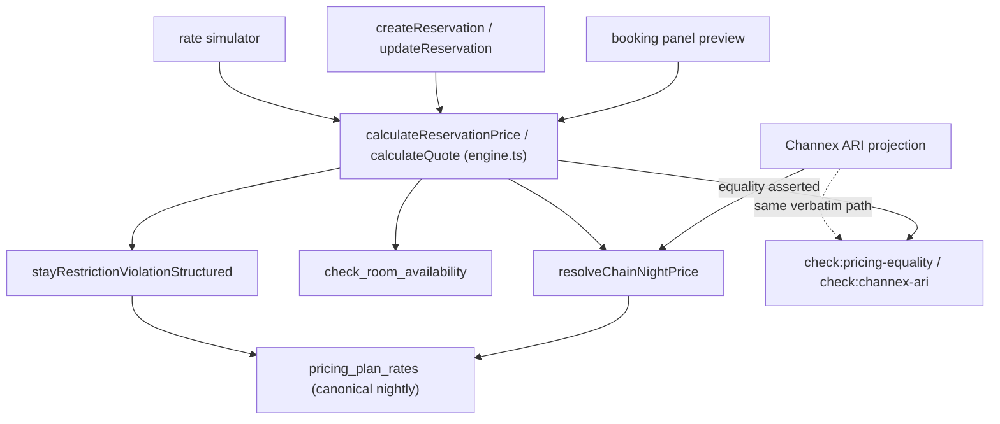

# GuestHub — Pricing & Restrictions

- **Status:** Complete — Stage 3, 2026-07-18
- **Branch:** `feat/pms-hardening-channex-certification`
- **Sources:** `docs/audit/PRICING_AUDIT.md`, ADR-0001, `docs/channex/PMS_CERTIFICATION_REQUIREMENTS.md`
- **Enforced by:** `check:pricing-engine`, `check:pricing-equality`, `check:channex-ari`, `check:timezone-and-money-invariants`

The pricing engine, the one quote seam, restriction semantics (min-stay Arrival/Through, CTA/CTD, stop-sell), and money/VAT/currency discipline.

## 1. One engine

There is exactly one server-side pricing engine — **`calculateReservationPrice` / `calculateQuote`** (`src/lib/pricing/engine.ts:124`, `:131`). Every committing or publishing surface reaches it: the booking-panel preview, the save path, the simulator, and the Channex ARI projection all share `resolveChainNightPrice` verbatim. Equality is mutation-verified: **booking preview ≡ save ≡ ARI projection** via `check:pricing-equality` and `check:channex-ari`.

The canonical nightly rate store is **`pricing_plan_rates`** (the store that replaced legacy `rates`). Plans are **dual-scope** (016); weekly/monthly are ordinary derived plans — no special engine branch.

## 2. Price precedence (fail-closed)

Resolution is strict and refuses to sell on a hole rather than guessing:

```
exact (plan, unit, date) rate
  → per-unit adjustment
  → plan adjustment
  → parent-chain price
  → base room-night
  → structured NO_PRICE_FOR_DATE   (a 0 or missing base is REFUSED, not sold)
```

## 3. Restrictions (dual-semantics, canonical)

All restriction checks go through the single validator **`stayRestrictionViolationStructured`** (`src/lib/rates/rules.ts`, called at `engine.ts:332`), and all are published explicitly to Channex:

| Restriction | Semantics |
|---|---|
| `min_stay_arrival` | evaluated on the **arrival-date** row |
| `min_stay_through` | **MAX** over every occupied night in the stay |
| CTA / CTD | closed-to-arrival / closed-to-departure on the relevant date |
| stop-sell | date is not sellable at all |

**Min Stay is DUAL** — both Arrival and Through are first-class and carried into the Stage-4 Channex Min-Stay declaration. Overlay rows merge tighten-only (the stricter restriction wins).

## 4. Money / VAT / currency discipline

- Money columns are **`numeric(12,2)`** in the schema; `check:timezone-and-money-invariants` asserts (against the DB) that no money column is stored as float/double.
- Rounding policy (engine §12): nightly resolved plan price → `round2` (`Math.round(n*100)/100`); extra-guest amount → the property rounding rule (`roundMoney`); totals summed in integer minor units. `balance` is unfloored (a negative balance is honest customer credit).
- **VAT is inclusive**, a single per-tenant scalar. **Tourist VAT zero-rating is unimplemented** — a known gap owned by **Stage 5** (F-4).
- Inbound OTA currency is stored as-is with **no conversion** — **Stage 5** (F-8).

## 5. Remaining gaps (owning stage)

- **Base-price fallback duplication (F-2):** the trivial `price ?? base_price` rule is re-implemented in several places (engine TS, ARI TS, `planNightlyPrice`, SQL `effective_sell_state`, calendar tooltip) with no compiler/test tying the SQL copy to the TS copies. Consolidate to one shared projection — **Stage 3/4** (ADR-0001 M10).
- **Direct-entry restriction enforcement:** min-stay/CTA/CTD are projected to Channex but must also be enforced on direct operator bookings in `createReservationAction` — verify and close (**Stage 3**, ADR-0001 GAP).
- Residual float fast-paths in the manual/committed total should route through one money module — **Stage 3+**.

## 6. Engine call-graph


