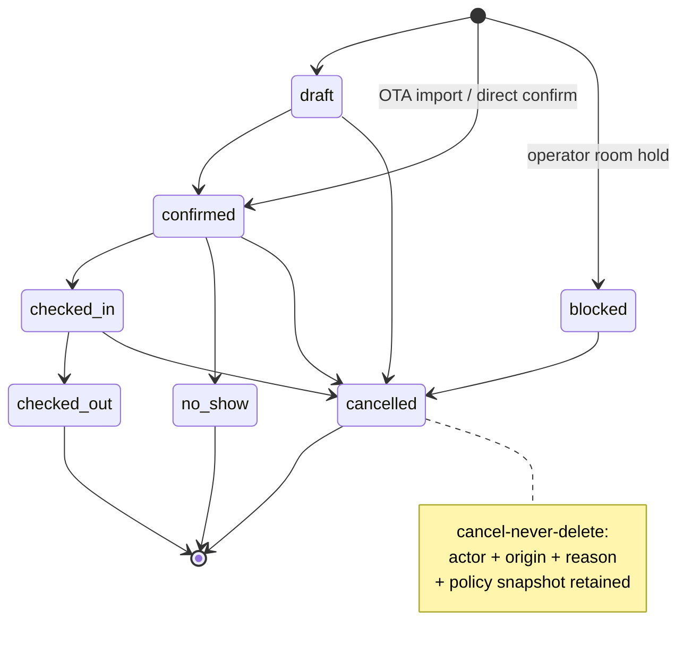
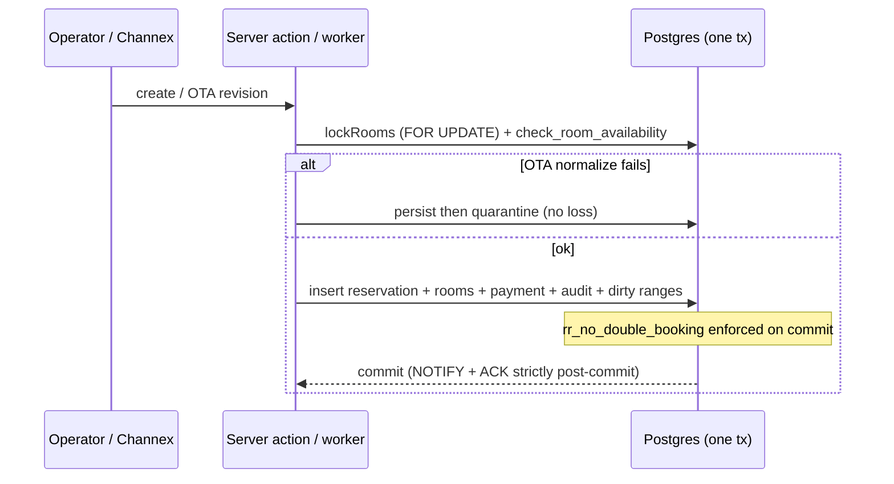

# GuestHub — Reservation Lifecycle

- **Status:** Complete — Stage 3, 2026-07-18
- **Branch:** `feat/pms-hardening-channex-certification`
- **Sources:** `docs/audit/RESERVATIONS_INVENTORY_AUDIT.md`, `docs/audit/WORKFLOW_INVENTORY.md`, ADR-0003
- **Enforced by:** `check:reservation-concurrency`, `check:status-default`, `check:pms-domain-invariants`

The full lifecycle of a reservation — create (manual + OTA), edit, reschedule, cancel, no-show, block — as states and as the transactional sequences that drive them.

## 1. State set

The canonical status set is now a **DB CHECK constraint** (migration 037), not just an application convention:

```
draft · confirmed · checked_in · checked_out · no_show · blocked · cancelled
```

Any other value is rejected at write time. The **blocking subset** — `confirmed`, `checked_in`, `blocked` — is single-sourced by SQL `guesthub.inventory_blocking_statuses()` and its TS mirror `INVENTORY_BLOCKING_STATUSES` (`src/lib/inventory-rules.ts`), CI-asserted equal. A reservation in a blocking status consumes physical inventory; the others do not. `blocked` is the operator-placed room hold (maintenance/owner use); it blocks like a real stay but is not a guest booking.

## 2. Transactional model

There is **one editor** (`updateReservationAction`, which never cancels) plus dedicated actions for create, reschedule, cancel, and OTA import. Every path runs as a single `sql.begin` transaction that atomically commits: the `reservations` row + `reservation_rooms` + `payments` + ledger recompute (`recomputePaymentAggregates`) + `audit_logs` + the `channel_dirty_ranges` outbox + `pg_notify` realtime events. NOTIFY fires on commit only.

**Creation.** Manual creation is operator-driven through the booking panel; OTA creation arrives via the Channex inbound pipeline (webhook → pull → normalize → apply → ACK). Both converge on the same aggregate write and the same availability guard.

**No-show** is a status change through the editor (`actions.ts`), not a dedicated action. An automated end-of-day sweep to flag un-checked-in arrivals is a named gap (below).

**Cancellation is cancel-never-delete**: the row is retained with actor, origin, reason, and a policy snapshot (034). Active OTA reservations refuse a *local* cancel — the OTA is the system of record for those.

## 3. Double-booking guard (ADR-0003, migration 037)

Overbooking prevention is now **two-layered**:

1. **Application layer (UX + ordering):** `lockRooms()` (`SELECT … FOR UPDATE`) then `check_room_availability()` inside the transaction — gives a friendly error and correct concurrency ordering.
2. **Database layer (guarantee):** the `rr_no_double_booking` EXCLUDE constraint on `reservation_rooms` — `EXCLUDE USING gist (room_id WITH =, daterange(check_in, check_out, '[)') WITH &&) WHERE (is_blocking)`. Two overlapping **blocking** stays on the same physical room are now impossible no matter what code path (or direct SQL) writes. `is_blocking` is a trigger-maintained mirror of `(room_id IS NOT NULL AND parent status ∈ blocking set)`: a `BEFORE` trigger on `reservation_rooms` and an `AFTER UPDATE OF status` trigger on `reservations` keep it correct, so a `draft→confirmed` transition is checked against the constraint at the moment of the transition. Ranges are half-open `[check_in, check_out)` — same-day checkout+checkin on one room does not collide.

This closes defect F1/H1 and scenario R9 (a direct-SQL insert bypassing `lockRooms` now fails at the DB). `check:reservation-concurrency` exercises R1–R9 against the disposable DB.

## 4. Remaining lifecycle gaps (owning stage)

- **No optimistic concurrency on edit** — a second operator's save can overwrite the first with stale form data (F3, **Stage 3+**).
- **No automated no-show / stale-status sweep** — no-show is manual only (`PMS_GAP_MATRIX.md`, **Stage 3+**).
- The OTA import contract (persist-then-quarantine, apply+mark in one tx, ACK strictly post-commit, DB-enforced duplicate identity) is preserved verbatim — it was already exemplary (F9).

## 5. State machine



## 6. Create / OTA-import sequence


