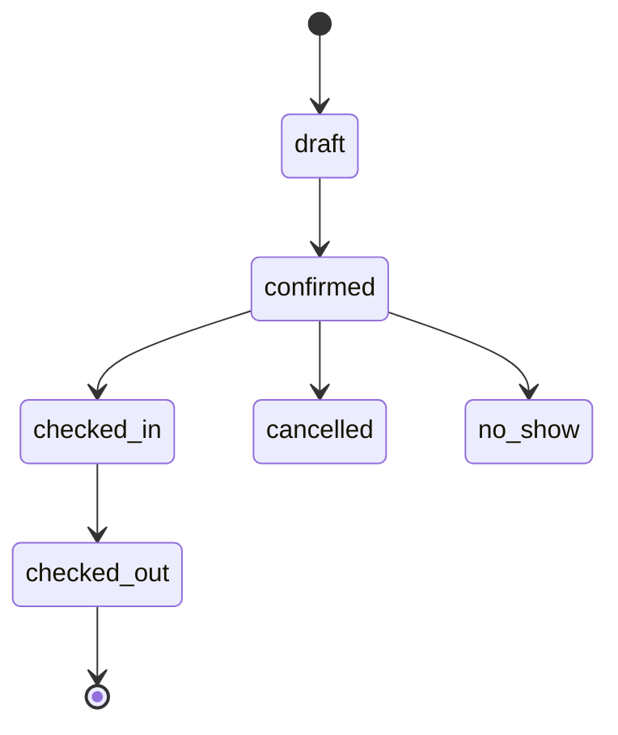
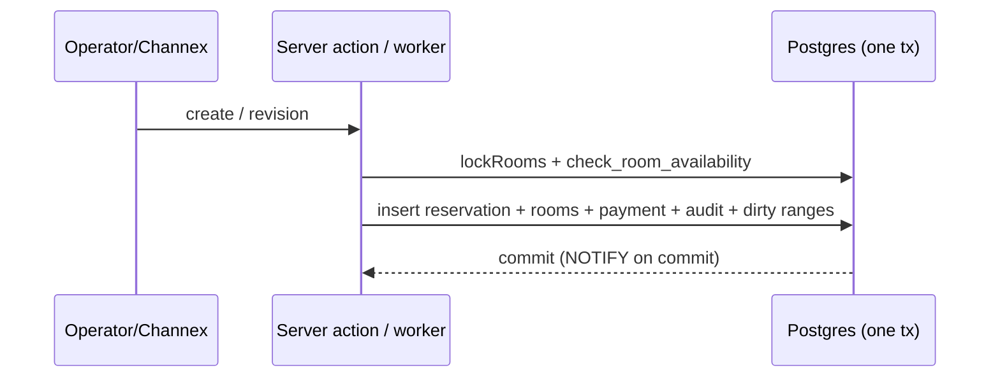

# GuestHub — Reservation Lifecycle

- **Status:** Skeleton — Stage 1; completed in **Stage 3**
- **Date:** 2026-07-18
- **Branch:** `feat/pms-hardening-channex-certification`
- **Sources:** `docs/audit/RESERVATIONS_INVENTORY_AUDIT.md`, `docs/audit/WORKFLOW_INVENTORY.md`, ADR-0003

The full lifecycle of a reservation — create (manual + OTA), edit, move, cancel, no-show — as states and as the transactional sequences that drive them.

## Current state

There is ONE editor (`updateReservationAction`, never cancels) and dedicated actions for create, reschedule, cancel, and OTA import; every path runs as a single `sql.begin` transaction that commits reservation + `reservation_rooms` + payments + ledger recompute + audit + `channel_dirty_ranges` + NOTIFY events atomically (`RESERVATIONS_INVENTORY_AUDIT.md` §1, §2 Q3; `WORKFLOW_INVENTORY.md` §1–§5). The status set is `draft/confirmed/checked_in/checked_out/no_show/blocked/cancelled`; the blocking subset (`confirmed, checked_in, blocked`) is single-sourced by `inventory_blocking_statuses()` and its TS mirror, CI-asserted. Cancellation is cancel-never-delete with actor/origin/reason on the row and a policy snapshot; active OTA reservations refuse local cancel (`RESERVATIONS_INVENTORY_AUDIT.md` §1.4). No-show is not a dedicated action — it is a status change through the editor (`actions.ts:619-621`).

Known lifecycle weaknesses for Stage 3: overbooking prevention is entirely application-level (`lockRooms` + `check_room_availability`), with **no DB guard** — nine designed race scenarios (R1–R9) are specified for the disposable DB, R9 proving a direct-SQL bypass commits silently (`RESERVATIONS_INVENTORY_AUDIT.md` §2 Q2, §3, F1). There is **no optimistic concurrency** on edit — a second operator's save overwrites the first with stale form data (F3). No-show is manual only — no end-of-day sweep flags un-checked-in arrivals (`PMS_GAP_MATRIX.md` §1). The OTA import pipeline (persist-then-quarantine, apply+mark in one tx, ACK strictly post-commit, DB-enforced duplicate identity) is exemplary (F9).

## Target state (per ADR-0003 and Stage 3)

- DB exclusion constraint as the last line of defense behind the existing app locks; status CHECK + generated blocking-status column (ADR-0003).
- Deterministic lock ordering to remove the reschedule/multi-room deadlock risk (M3/F4).
- Optimistic-concurrency guard on edit (address F3).
- Automated no-show / stale-status end-of-day sweep (`PMS_GAP_MATRIX.md`, Stage 3).
- Preserve the idempotent OTA apply/ACK contract verbatim.

## To be completed in Stage 3

- [ ] State machine diagram (draft→confirmed→checked_in→checked_out; cancelled/no_show/blocked branches) — Mermaid state diagram.
- [ ] Create/edit/move/cancel transactional sequence diagrams — Mermaid sequence.
- [ ] OTA import sequence (webhook → pull → normalize → apply → ACK) with quarantine branch.
- [ ] Concurrency/race table with the new constraint's expected outcomes (R1–R9).
- [ ] No-show sweep design.

