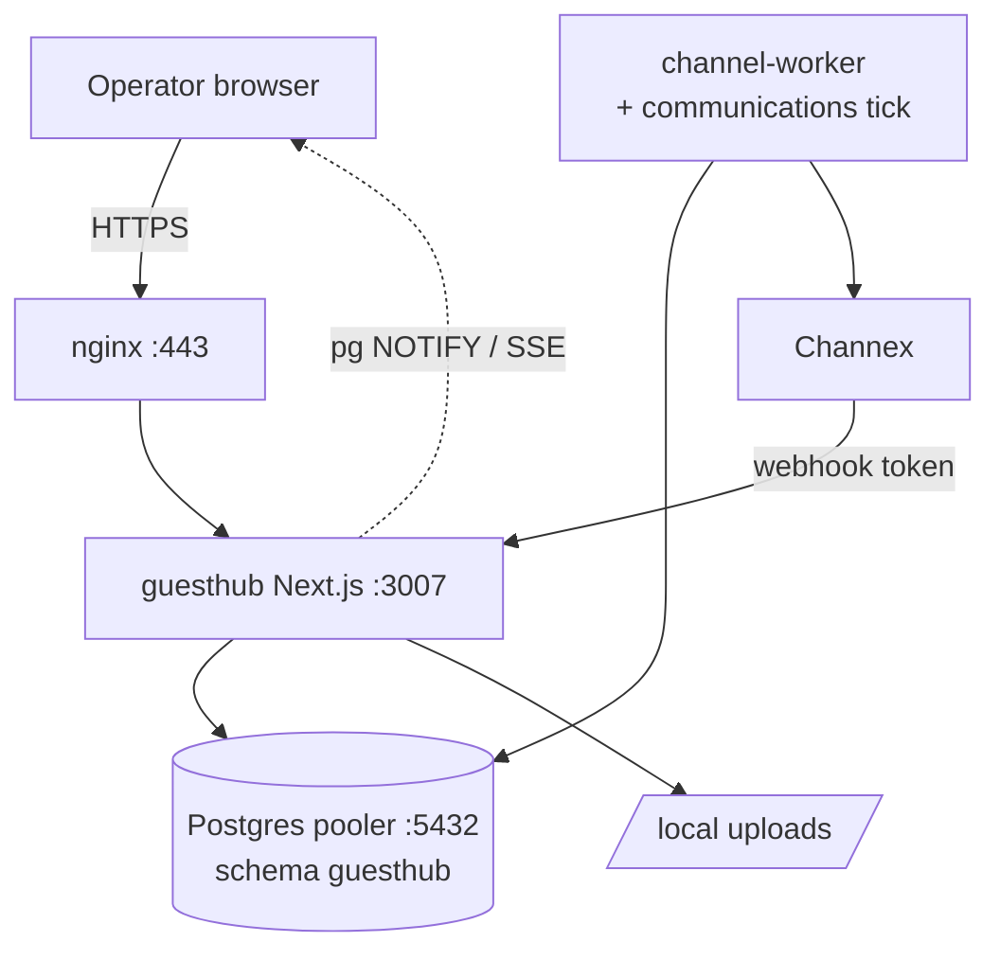

# GuestHub — System Overview

- **Status:** Skeleton — Stage 1; current-state populated now, completed/finalized in **Stage 7**
- **Date:** 2026-07-18
- **Branch:** `feat/pms-hardening-channex-certification`
- **Sources:** `docs/architecture/TARGET_ARCHITECTURE.md`, `docs/audit/ARCHITECTURE_INVENTORY.md`, `docs/audit/DEFECT_MATRIX.md`

This is the top-level map of what GuestHub is, how its parts fit together, and where the seven-stage program moves it. It is the reader's entry point into the deeper §23 documents (domain model, reservation lifecycle, inventory, pricing, payments, jobs, authz, observability, deployment) and the Channex/security sets.

## Current state

GuestHub is a Hebrew/RTL single-property PMS on **Next.js 15.5.20** (App Router, React 19, Tailwind v4), served by one PM2 web process (`guesthub`, `npm start`, `:3007`) plus one PM2 worker (`guesthub-channel-worker`), both running from `/var/www/guesthub-production` (`ARCHITECTURE_INVENTORY.md` §1). Business logic lives in Server Actions and a small set of Route Handlers under `src/app/api/`; data access is raw schema-qualified SQL via `postgres.js` against the `guesthub` schema (60 tables) of a **shared** self-hosted Supabase Postgres reached through the Supavisor pooler on `:5432`. Auth is Supabase GoTrue via Kong; tenant isolation is enforced entirely in server code (`actor.tenantId`), with no RLS (`ARCHITECTURE_INVENTORY.md` §2, §5).

Asynchronous work runs on database-backed queues (no Redis/broker): the durable `channel_sync_jobs` queue (leases, `FOR UPDATE SKIP LOCKED`, FIFO per connection), the `channel_dirty_ranges` ARI outbox, and the communications `communication_events`→`communication_delivery_attempts` queue — the last riding **inside the same worker tick** as Channex sync (coupling M16, `ARCHITECTURE_INVENTORY.md` §3, Finding #7). Integrations: Channex (staging), Gmail OAuth, GREEN-API/Twilio, Google Maps, and local-disk uploads at `/var/www/guesthub-uploads`. Two program-critical facts frame everything else: **dev and prod share the same live DB (Critical C1)** and the **Postgres pooler/Kong are internet-reachable because Docker publishing bypasses UFW (Critical C2)** (`ARCHITECTURE_INVENTORY.md` Findings #1–#2).

Confirmed strengths to preserve: one pricing engine with quote↔ARI equality, an authoritative payments ledger, a crash-safe queue with ACK-after-commit, an escape-first email renderer, a fail-closed card vault, and triple deploy guards (`TARGET_ARCHITECTURE.md` §2).

## Target state

- One source of truth per business concept (ADR-0001); layered separation UI → validation → services → domain → persistence → provider clients → workers → audit (`TARGET_ARCHITECTURE.md` §1).
- Dedicated per-environment Postgres clusters + GoTrue (Stage 2, ADR-0002), structurally resolving C1; DB exposure hardening (C2) in Stage 6.
- Worker split so ARI sync and communications no longer share a failure domain (Stage 3, M16).
- Channex environment routing from `channel_connections.environment`, certification evidence ledger, production activation guard (Stage 4, ADR-0004).
- Stage 7 finalizes this document as the delivered system-of-record diagram after all stages land (no merge, no deploy, no cutover).

## To be completed in Stage 7

- [ ] Finalize the system diagram to reflect the delivered topology (dedicated clusters, split workers, evidence ledger). Update the Mermaid block below.
- [ ] Component responsibility table (web app, channel worker, communications worker, DB clusters, uploads, backup) with final owners.
- [ ] Cross-links to every §23 doc with a one-line "what it covers".
- [ ] Data-flow narrative: operator action → validation → service → persistence → outbox → worker → Channex, and inbound OTA → webhook → worker → reservation.
- [ ] Confirm C1/C2 resolution status at delivery time.

