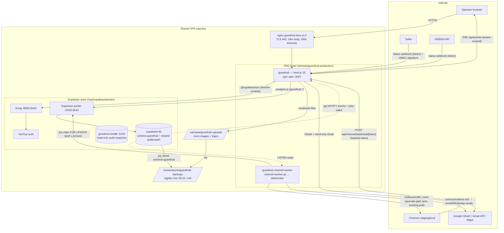

# GuestHub — Architecture Inventory (Current State)

- **Date:** 2026-07-18
- **Reflects branch:** `feat/pms-hardening-channex-certification` (dev checkout `/var/www/guesthub`)
- **Scope:** V2 audit spec §7 — read-only inventory of runtimes, workers, data stores, providers, jobs, storage, auth, webhooks, cron, env-var names, deployment, and nginx exposure. No values/secrets are reproduced here.

---

## 1. Runtime applications

| Component | What it is | Where it runs |
|---|---|---|
| **GuestHub web app** | Next.js 15.5.20 (App Router, React 19, Turbopack build, Tailwind v4). Hebrew/RTL PMS: calendar, reservations, rates, rooms, channels, guests, communications, settings, staff, permissions, housekeeping. | PM2 app `guesthub` = `npm start`, `PORT=3007`, `cwd=/var/www/guesthub-production` (see `docs/PRODUCTION_RUNTIME.md`) |
| **Channel worker** | Long-running Node process (`scripts/channel-worker.cjs` → compiled `dist/worker/lib/channel/worker.js`). Drains the DB job queue: outbound ARI to Channex, inbound booking pulls, plus the guest-communications tick. No port, no HTTP input. | PM2 app `guesthub-channel-worker`, declared in `ecosystem.config.cjs`, same checkout + same `.env.local` as the web app |
| **Dev hub / worktrees** | `/var/www/guesthub` (hub repo, not a runtime) and `/var/www/guesthub-worktrees/<name>` feature worktrees. Never share `.next`, port, or PM2 process with production. | — |

Key config:

- `next.config.ts` — single experimental option: `middlewareClientMaxBodySize: "18mb"` (matches nginx `client_max_body_size 18m` for 15 MiB room-image uploads).
- `ecosystem.config.cjs` — declares **only** the worker (fork mode, 1 instance, `min_uptime 30s`, `max_restarts 10`, `restart_delay 5000`, `kill_timeout 15000`, `max_memory_restart 300M`, env `CHANNEL_WORKER_INTERVAL_MS=20000`). The web app is deliberately *not* declared there — it is restarted by name in the deploy script so its existing PM2 registration is never rewritten.
- `tsconfig.worker.json` — `postbuild` compiles the worker tree to `dist/worker` on every `npm run build`.

### `src/` structure (top two levels)

```
src/
├── middleware.ts              # Supabase cookie refresh + login/webhook routing rules
├── app/
│   ├── (dashboard)/           # calendar, channels, communications, dashboard, guests,
│   │                          # permissions, rate-plans, rates, reservations, rooms,
│   │                          # settings, staff  (+ layout with role routing)
│   ├── api/                   # branding/logo, channel/webhook/[token], events (SSE),
│   │                          # messaging (gmail oauth + webhooks), reservations/[id]/pdf,
│   │                          # rooms/images
│   ├── auth/                  # callback (OAuth code exchange), signout
│   ├── housekeeping/          # cleaner-facing views
│   ├── login/                 # login page + server action
│   ├── uploads/               # route-handler file serving: logos/[tenantId]/[name],
│   │                          # rooms/[roomId]/[name]
│   └── styles/ globals.css fonts/
├── components/                # communications, layout, providers, reservations, shared, ui
└── lib/
    ├── auth/                  # actor.ts, guards.ts, permission-check.ts, actions.ts
    ├── channel/               # 36 modules: queue, worker, ari-*, channex-*, booking-import,
    │                          # crypto, outbox, reconcile, revisions, sync-state …
    ├── communications/        # automation, delivery, outbox, renderer, schedule, worker
    ├── messaging/             # providers, secrets (AES-GCM vault), email/, whatsapp/
    ├── payments/ pricing/ rate-plans/ rates/ reservations/ rooms/ settings.ts
    ├── realtime/              # events.ts, hub.ts (pg LISTEN), publish.ts (pg NOTIFY)
    ├── supabase/              # client.ts, server.ts, admin.ts (service-role via Kong)
    ├── db.ts                  # postgres.js pool → Supavisor session pooler
    ├── card-vault.ts          # AES-256-GCM PAN vault (CARD_VAULT_KEY)
    └── audit.ts audit-write.ts uploads/ validation/ pdf/ …
```

---

## 2. Databases and schemas

| Store | Details |
|---|---|
| **Production Postgres** | Self-hosted Supabase stack (`/opt/supabase/docker`): container `supabase-db` (postgres 15.8), reached through **Supavisor pooler** `supabase-pooler` on host port **5432** (session mode; port 6543 also published). The app's `DATABASE_URL` points at the pooler. |
| **Schema model** | All GuestHub tables live in the **`guesthub` schema** and every query is schema-qualified — the pooler drops the `search_path` startup param, and the shared `postgres` DB's `public` schema hosts a **different project** with colliding table names (`src/lib/db.ts:4-6`, DECISIONS.md D4). GoTrue identities live in the Supabase `auth` schema of the same DB. |
| **Connection layer** | `postgres.js` (`prepare: true, max: 10, idle_timeout: 20`) — one pool per Node process (web + worker), `globalThis` singleton in dev. Supabase JS clients (`@supabase/ssr`) talk to Kong (`:8000/:8443`) for auth only; data access is raw SQL. |
| **Test snapshot** | Container `guesthub-testdb` (postgres 15.8) on host port **5433**, DB `guesthub_stage1_restore` — read-only restore of the guesthub schema for audits/checks (`TEST_DATABASE_URL`). |

### `guesthub` schema table inventory (58 tables, from the snapshot)

- **Tenancy/identity:** `tenants`, `users`, `roles`, `permissions`, `role_permissions`, `user_permission_overrides`
- **Rooms/inventory:** `rooms`, `room_types`, `room_images`, `room_amenities`, `room_translations`, `room_closures`, `areas`, `operational_areas`, `floors` via lookup, `lookup_items`, `sellable_units`, `sellable_unit_rooms`, `sellable_units_backup_028` (leftover), `housekeeping_tasks`
- **Reservations/guests:** `reservations`, `reservation_rooms`, `reservation_cards`, `reservation_payment_methods`, `guests`
- **Pricing:** `pricing_plans`, `pricing_plan_rates`, `pricing_plan_units`, `pricing_plan_unit_rates`, `rates`, `bulk_rate_update_logs`, `bulk_rate_update_items`
- **Payments/policies:** `payments`, `payment_policies`, `payment_policy_stages`, `cancellation_policies`, `cancellation_policy_tiers`
- **Channel manager (Channex):** `channel_connections`, `channel_sync_jobs`, `channel_webhook_events`, `channel_booking_revisions`, `channel_dirty_ranges`, `channel_worker_state`, `channel_sync_errors`, `channel_room_type_mappings`, `channel_rate_plan_mappings`, `channel_room_mappings`, `channel_room_rate_mappings`, `channel_inbound_rate_plan_aliases`, `channel_inventory_holds`, `channel_external_changes`
- **Messaging/communications:** `messaging_provider_connections`, `message_templates`, `message_template_versions`, `outbound_messages`, `message_events`, `communication_automations`, `communication_events`, `communication_delivery_attempts`, `communication_settings`
- **Audit:** `audit_logs`

### Migrations

- `db/migrations/000 … 036` applied **manually** via the `supabase-db` container. There is **no migration ledger table** in the schema (no `schema_migrations`), and `npm run db:migrate` pipes only `000_init_schema.sql`.
- Numbering anomalies: two files share prefix `009_` (`009_phase4_card_channel.sql`, `009_phase4a_sellable_units.sql`); `021_*` is **absent from the current branch** although it was written and applied historically (see Findings #1/#3).
- The deploy guard blocks deploying a release whose branch adds migration files not yet on `origin/main`.

---

## 3. Background jobs and queues

All queues are **database tables** — no Redis/external broker.

| Queue | Producer | Consumer | Mechanics |
|---|---|---|---|
| `channel_sync_jobs` | Web app (operator actions, webhook route) + worker self-enqueue | PM2 channel worker | Job types: `full_sync`, `sync_ari_range`, `pull_booking_revisions`, `import_booking_revision`, `sync_room_types`/`create_room_type`, `sync_rate_plans`/`create_rate_plan`, `reconcile_inventory`, etc. (`src/lib/channel/queue.ts`). Idempotency keys; priority (webhook pull = 20 < routine 40 < drain 50 < default 100); claim via `FOR UPDATE SKIP LOCKED`, FIFO per connection, one live job per connection; lease expiry reclaims crashed workers' jobs; `suppressed` status prevents dead backlogs. |
| `channel_webhook_events` | `/api/channel/webhook/[token]` | Worker (via enqueued pull job) | Redacted payload + dedup key persisted in the **same transaction** as the pull job (D77). |
| `channel_dirty_ranges` | Any write that changes ARI | Worker drain (`drainAriDirtyRanges`) | Outbound ARI only for connections `state='active' AND outbound_sync_enabled AND NOT full_sync_required` — i.e. only after operator-run Full Sync. |
| `communication_events` → `communication_delivery_attempts` | Domain events (reservation lifecycle) | `runCommunicationTick` inside the **same** channel worker tick | Claims 10 events/tick, materialises deliveries from human-enabled automations, drains sends (email via Gmail, etc.). |
| `outbound_messages` / `message_events` | Messaging UI + automations | Provider send + status webhooks | Monotonic status lifecycle, idempotent event recording. |

**Wake-up model:** enqueue does `pg_notify` on `JOBS_WAKE_CHANNEL`; the worker LISTENs and also polls every `CHANNEL_WORKER_INTERVAL_MS` (20 s prod), max 5 jobs/tick.

---

## 4. External providers

| Provider | Purpose | Integration point | Credential handling |
|---|---|---|---|
| **Channex** | Channel manager (Booking.com live). ARI push, room-type/rate-plan sync, booking revision pull. | `src/lib/channel/channex-*.ts`; base URLs hard-coded in `config.ts` (`staging.channex.io` / `app.channex.io`) — the only env boundary. | Per-tenant API key encrypted with `CHANNEL_SECRETS_KEY` (AES-256-GCM, `src/lib/channel/crypto.ts`). |
| **Supabase GoTrue** (`supabase-auth` container) | Authentication (password + OAuth session management). | `@supabase/ssr` clients via Kong gateway; admin ops via `SUPABASE_ADMIN_URL` + `SUPABASE_SERVICE_ROLE_KEY` (`src/lib/supabase/admin.ts`). | Anon key public; service-role key server-only. |
| **Gmail (Google OAuth)** | Tenant outbound email (send-only scope). | `/api/messaging/gmail/oauth` + `/callback` — CSRF state cookie, code→refresh-token exchange, super-admin re-check. | `GOOGLE_OAUTH_CLIENT_ID`/`SECRET` env; per-tenant refresh token stored encrypted (`MESSAGING_SECRETS_ENCRYPTION_KEY`). `nodemailer` is used on the email path. |
| **GREEN-API** | WhatsApp sending + status callbacks. | `src/lib/messaging/whatsapp/`, webhook `/api/messaging/webhook/green-api/[token]`. | Encrypted secret bag; opaque webhook token is the sole auth (provider does not sign). |
| **Twilio** | WhatsApp/SMS + status callbacks. | Webhook `/api/messaging/webhook/twilio/[token]`. | Opaque token **plus** `X-Twilio-Signature` HMAC-SHA1 verified against the canonical `NEXT_PUBLIC_APP_URL` callback URL. |
| **Google Maps** | Business-profile address/location picker. | Browser-side `importLibrary` loader keyed by `NEXT_PUBLIC_GOOGLE_MAPS_BROWSER_KEY`. | Public browser key (referrer-restricted at Google). |
| **Let's Encrypt / Certbot** | TLS for `guesthub.bios.co.il`. | nginx vhost. | — |

---

## 5. Authentication flow

1. **Login** (`src/app/login/actions.ts`): server action accepts email **or** username; a non-email identifier is resolved to its email from `guesthub.users` (active only), then `supabase.auth.signInWithPassword` against GoTrue. Errors are deliberately vague.
2. **Session** — Supabase cookies. `src/middleware.ts` runs on every non-static request: refreshes the auth cookie, redirects unauthenticated → `/login`, authenticated visitors away from `/login`. Explicit bypasses: `/auth/callback` (OAuth code exchange), `/api/messaging/webhook/*`, `/api/channel/webhook/*` (server-to-server, token-authenticated — the D76/D77 "webhook 307'd to /login" root cause).
3. **Actor resolution** (`src/lib/auth/actor.ts`): GoTrue user → `guesthub.users` join (tenant, role, permission set). Every server action tenant-scopes by `actor.tenantId`; client-supplied tenant ids are never trusted. Permission checks fail closed (`requirePermission`).
4. **Role routing** happens in the `(dashboard)` layout (cleaner → `/housekeeping/my-tasks`); Edge middleware only knows session existence.
5. **Admin auth ops** (create/ban users, seeding) use the service-role client against the local Kong gateway.

---

## 6. Webhooks (routes + token model)

| Route | Direction | Auth model |
|---|---|---|
| `POST /api/channel/webhook/[token]` | Channex → app | Opaque per-connection capability token (min length enforced); only its **SHA-256 hash** is stored (`channel_connections.webhook_token_hash`). Must match an `active`, inbound-enabled connection or the route 404s (no existence oracle). In-memory fixed-window rate limit per token (120/min, 5 000 tracked keys), 256 KiB body cap, payload **redacted** before persistence, dedup + job enqueue in one transaction, sanitized 503 on failure so Channex retries. |
| `POST /api/messaging/webhook/green-api/[token]` | GREEN-API status → app | Opaque server-generated token resolves connection/tenant (never the guessable instance id). No provider signature exists; unguessability is the auth. Idempotent + monotonic status application. |
| `POST /api/messaging/webhook/twilio/[token]` | Twilio status → app | Two layers: opaque path token, then cryptographic `X-Twilio-Signature` (HMAC-SHA1 with the connection's decrypted auth token over the canonical URL built from `NEXT_PUBLIC_APP_URL`, never the request Host). Returns 204. |
| `GET /api/messaging/gmail/oauth` / `.../callback` | Google OAuth round-trip | CSRF state cookie; super-admin + tenant re-verified in callback; coarse error codes only — no token ever appears in URLs or logs. |

**Realtime (related plumbing):** domain writes `pg_notify` on `EVENTS_CHANNEL`; each web process holds ONE `sql.listen` connection (`src/lib/realtime/hub.ts`) fanning out in-process to `GET /api/events` SSE subscribers, tenant-bound server-side, 25 s heartbeat, 10-min max stream life to force re-auth. The same NOTIFY channel wakes the PM2 worker.

---

## 7. File storage (local disk)

- **Store:** `UPLOADS_DIR` → `/var/www/guesthub-uploads` — deliberately **outside** every checkout/build tree so media survives deploys/rollbacks; **shared by dev and production checkouts** (`src/lib/rooms/uploads.ts`).
- **Contents:** `rooms/<roomId>/<uuid>.(jpg|png|webp)` (≤15 MiB app-validated) and tenant logos.
- **Serving:** route handlers (`src/app/uploads/rooms/[roomId]/[name]/route.ts`, `.../logos/...`) with strict UUID/extension regexes — not `public/` (Next snapshots `public/` at boot).
- **Size chain:** nginx `client_max_body_size 18m` → Next middleware body buffer 18 mb → app-side 15 MiB validation.
- Supabase Storage/imgproxy containers exist in the stack but GuestHub does **not** use them — storage is local disk only, backed up nightly.

---

## 8. Scheduled tasks (cron, user `ubuntu`, TZ=Asia/Jerusalem)

| Schedule | Task |
|---|---|
| `15 3 * * *` | `bash /var/www/guesthub-production/scripts/nightly-backup.sh >> ~/logs/guesthub-backup.log` — schema-scoped `pg_dump --schema=guesthub` via `supabase-db` container + tar of `/var/www/guesthub-uploads`, into `/home/ubuntu/guesthub-backups`, 14-day rotation. |
| (host, non-GuestHub) | DevOPS kit updates (morning/evening), `almog` bllink-sync 07:30, mail-system sync 07:00/19:00, MarketPilot pipeline 06:00–hourly. Listed only to show shared-host contention. |

There is **no cron inside GuestHub itself** — all recurring app work (ARI drains, booking pulls, communications) runs in the PM2 worker loop by design.

---

## 9. Environment variables (names only, grouped)

| Group | Names |
|---|---|
| Core app / DB | `DATABASE_URL`, `APP_PORT`, `NEXT_PUBLIC_APP_URL`, `NODE_ENV` |
| Supabase / auth | `NEXT_PUBLIC_SUPABASE_URL`, `NEXT_PUBLIC_SUPABASE_ANON_KEY`, `SUPABASE_ADMIN_URL`, `SUPABASE_SERVICE_ROLE_KEY` |
| Encryption vaults (three separate blast radii) | `CARD_VAULT_KEY` (PAN vault), `CHANNEL_SECRETS_KEY` (Channex creds), `MESSAGING_SECRETS_ENCRYPTION_KEY` (provider secret bags) |
| External providers | `GOOGLE_OAUTH_CLIENT_ID`, `GOOGLE_OAUTH_CLIENT_SECRET`, `NEXT_PUBLIC_GOOGLE_MAPS_BROWSER_KEY` |
| Worker | `CHANNEL_WORKER_INTERVAL_MS` |
| Storage / backup | `UPLOADS_DIR`, `DEST`, `PROD_DIR` (backup script overrides) |
| Deploy / guards | `PROD_DEPLOY_OK`, `APPROVED_MAIN_COMMIT`, `PORT`, `PM2_APP`, `PM2_WORKER` |
| Test/check harness only | `TEST_DATABASE_URL`, `HYDRATION_BASE_URL`, `HYDRATION_EMAIL`, `HYDRATION_PASSWORD`, `SEED_SKIP_AUTH`, `CDP_PORT`, `CHROME_BIN` |

---

## 10. Deployment process

Three fail-closed layers (all in `scripts/`):

1. **`prebuild-guard.mjs`** (npm `prebuild`) — a checkout marked with `.production-runtime` refuses `next build` unless `PROD_DEPLOY_OK=1`. Feature worktrees carry no marker → always buildable.
2. **`production-deploy-guard.mjs`** — refuses unless: clean tracked tree, HEAD reachable from `origin/main`, on `main` (or HEAD == `APPROVED_MAIN_COMMIT`), explicit `PROD_DEPLOY_OK=1`, and **no migration files added outside the approved release** (three-dot diff vs `origin/main`).
3. **`deploy-production.sh`** (`PROD_DEPLOY_OK=1 npm run deploy:prod`, run inside `/var/www/guesthub-production`): opt-in check → marker check → `git fetch` → guard → `git checkout main && merge --ff-only origin/main` → guard re-run → build (also produces `dist/worker`) → `pm2 restart guesthub` + `pm2 startOrRestart ecosystem.config.cjs --only guesthub-channel-worker` → verifies PM2 cwd for **both** apps, worker survives 6 s, port 3007 answers, critical routes `/ /login /calendar` return non-5xx → reports commit + BUILD_ID. Any failure aborts before restart.

Migrations are applied manually to the `supabase-db` container per project procedure; seeding is fail-closed (`seed.mjs` refuses production).

---

## 11. nginx exposure (`/etc/nginx/sites-enabled`, read-only)

- **`guesthub.bios.co.il`** → `proxy_pass http://127.0.0.1:3007` (HTTP/1.1 + upgrade map for SSE/WS), Certbot TLS on 443, HTTP→HTTPS 301, `client_max_body_size 18m`, `proxy_read/send_timeout 300s`, forced `Cache-Control: no-store` on `/` (not on `/_next/`). No HSTS or other security headers in this vhost.
- Other enabled sites on the shared host: `almog`, `billing`, `dashboard`, `invoice`, `mail-system`, `marketpilot`, `pms`, `sea-tower`, `supabase`, `sys`, plus a `default.disabled` symlink still present in `sites-enabled/`.
- **Host listeners observed:** `0.0.0.0:5432` (Supavisor pooler → production Postgres), `0.0.0.0:5433` (test snapshot DB), `0.0.0.0:8000`/`8443` (Kong), `*:3007` (Next). UFW allows only 22/80/443/41641 — but see Finding #2: Docker-published ports bypass UFW.

---

## 12. Scripts inventory (`scripts/`, one line each)

| Script | Purpose |
|---|---|
| `channel-worker.cjs` | PM2 entry point: module-alias shim + env checks, then runs compiled `runChannelWorker` with graceful SIGTERM drain. |
| `server-only-stub.cjs` | Stubs the `server-only` package so the compiled worker can `require` app modules. |
| `deploy-production.sh` | The only approved production build+restart (see §10). |
| `production-deploy-guard.mjs` | Fail-closed git/migration preconditions for deploy. |
| `prebuild-guard.mjs` | Refuses direct builds inside the marked production checkout. |
| `nightly-backup.sh` | Cron: guesthub-schema pg_dump + uploads tar, 14-day rotation. |
| `seed.mjs` | Dev seeding; fail-closed against production. |
| `complete-rooms-data.mjs` | One-off room data completion helper. |
| `lib/e2e-write-guard.mjs` | Shared guard that keeps check scripts from writing to production. |
| `check-e2e-safety.mjs` / `check-seed-safety.mjs` / `check-guards.mjs` | Verify the safety guards themselves (mutation-verified). |
| `check-business-profile.mjs`, `check-maps-picker.mjs` | Business-profile settings + Google Maps picker regressions. |
| `check-calendar.mjs`, `check-calendar-ui.mjs` | Calendar logic and rendered-UI checks. |
| `check-cards.mjs`, `check-channel-card-ingest.mjs`, `check-payments.mjs` | Card vault, OTA card ingest, payment/ledger reconciliation suites. |
| `check-channel-worker.mjs`, `check-channex-ari.mjs`, `check-channex-connection.mjs`, `check-channex-credential.mjs`, `check-channex-properties.mjs`, `check-channex-rate-plans.mjs`, `check-channex-room-types.mjs` | Channex integration suites (worker loop, ARI projection, connection test, credential handling, property/rate-plan/room-type sync). |
| `check-channels-badge.mjs`, `check-channels-fullsync-ui.mjs`, `check-channels-hydration.mjs`, `check-hydration-browser.mjs` | /channels UI, Full Sync button, SSR-hydration regressions (browser-driven). |
| `check-inbound-bookings.mjs`, `check-realtime-cancellation.mjs` | Inbound BDC import and realtime cancellation flows. |
| `check-check-in-check-out.mjs` / `-db.mjs` | Check-in/out policy logic + DB state. |
| `check-commercial.mjs` / `-db.mjs`, `check-settings-regression.mjs` | Commercial settings (extra-guest pricing, policies) + /settings regressions. |
| `check-rate-plans.mjs`, `check-pricing-engine.mjs`, `check-pricing-equality.mjs`, `check-room-pricing.mjs`, `check-reservation-snapshot.mjs` | Pricing engine and canonical reservation-pricing equality suites. |
| `check-rate-grid.mjs`, `check-rates-ui.mjs`, `check-rates-sync.mjs`, `check-rates-date-policy.mjs`, `check-effective-state.mjs`, `check-inventory.mjs`, `check-rate-sellability.mjs` | Rates grid, sale-state, inventory and sellability suites (some need `.env.local`). |
| `check-rooms-module.mjs`, `check-room-db.mjs`, `check-room-deletion.mjs`, `check-room-identity.mjs`, `check-su-lifecycle.mjs` | Rooms module, canonical room identity, sellable-unit lifecycle. |
| `check-messaging.mjs`, `check-guest-communications*.mjs` (×4) | Messaging providers + guest-communications templates/automation/worker/DB. |
| `check-datepicker.mjs`, `check-design-system.mjs`, `check-status-default.mjs`, `check-reservations-ui.mjs` | Date-range picker, design-system gate, status-default lock, reservations UI. |

---

## 13. System architecture diagram



---

## 14. Findings

Numbered defects/risks observed at the architecture layer. Severity: Critical / High / Medium / Low.

1. **[High] Migration `021` is applied in production but absent from the current branch/main history.** The file `021_room_inventory_cleanup.sql` was added in commit `597801a` (D54), which is **not an ancestor of HEAD**; `db/migrations/` today jumps `020 → 022`. The schema's true history cannot be reconstructed from the deployable branch. Evidence: `ls db/migrations` (no `021*`); `git show --stat 597801a` shows `db/migrations/021_room_inventory_cleanup.sql`; `git merge-base --is-ancestor 597801a HEAD` → non-ancestor.
2. **[Critical] Production database pooler and Kong are internet-reachable — Docker publishing bypasses UFW.** `supabase-pooler` listens on `0.0.0.0:5432` (and `:6543`), `guesthub-testdb` on `0.0.0.0:5433`, Kong on `0.0.0.0:8000/8443` (`docker ps`, `ss -tln`). UFW allows only 22/80/443/41641, but Docker-published ports insert their own iptables rules ahead of UFW, and the `DOCKER-USER` chain is **empty** (`sudo iptables -L DOCKER-USER -n` → no rules) — so nothing on this host blocks external connections to the production Postgres pooler or the unauthenticated-by-default test snapshot DB, unless an upstream cloud firewall exists (not verifiable here). Password auth is the only remaining barrier on 5432/5433.
3. **[High] No migration ledger.** The `guesthub` schema has no `schema_migrations`-style table (snapshot table list, §2); migrations are applied by hand and `npm run db:migrate` (`package.json:13`) pipes only `000_init_schema.sql`. Combined with #1 and the duplicate `009_` prefix (`009_phase4_card_channel.sql` + `009_phase4a_sellable_units.sql`), applied-state vs repo-state can silently diverge.
4. **[High] Nightly backup omits the `auth` schema — a restore loses every login.** `scripts/nightly-backup.sh:15` runs `pg_dump --schema=guesthub` only. GoTrue identities (`auth.users`, credentials) live outside that schema, and `guesthub.users.auth_user_id` references them; the restored snapshot DB indeed contains only `guesthub` + `public`. Disaster recovery as currently scripted cannot restore authentication.
5. **[Medium] Backups are unencrypted, on the same host, with no off-host copy.** `/home/ubuntu/guesthub-backups` holds 14 days of SQL dumps (including AES-encrypted PANs and encrypted provider secrets) and uploads tars on the same disk as the database and the `.env.local` that holds the decryption keys (`scripts/nightly-backup.sh:7-22`). A single host compromise or disk loss takes data, backups, and keys together.
6. **[Medium] GuestHub cohabits a shared multi-project Postgres.** `src/lib/db.ts:4-6`: the shared `postgres` DB's `public` schema hosts a *different* project with colliding table names; the pooler drops `search_path`, so one unqualified query touches the wrong project. Backup/maintenance scripts run as `supabase_admin` (superuser-level) rather than a least-privilege guesthub role.
7. **[Medium] One PM2 worker couples Channex sync and guest communications.** `runCommunicationTick` runs inside the channel worker's tick (`src/lib/channel/worker.ts:13,201`); a Channex incident, long full-sync, crash-loop (max 10 restarts) or the 300 MB memory restart delays or halts guest emails/WhatsApp, and vice versa. Single instance, no independent health probe per concern.
8. **[Medium] Dev and production share the same live uploads store.** `src/lib/rooms/uploads.ts` documents that every checkout on the host (dev + production) reads/writes `/var/www/guesthub-uploads`. A dev-side bug (e.g. deletion path under test) mutates production media with no isolation; the D55 memory confirms deletion features exist. |
9. **[Medium] Cardholder data (PAN) is stored in the application database.** AES-256-GCM with a separate `CARD_VAULT_KEY` and fail-closed design (`src/lib/card-vault.ts`) is sound engineering, but storing PANs at all places the whole host, DB, backups (#5) and public repo's operational surface inside PCI DSS scope; key and ciphertext live on the same host.
10. **[Low] Channel webhook rate limiter is per-process, in-memory, and flushes wholesale.** `src/app/api/channel/webhook/[token]/route.ts:26-38`: at 5 000 tracked keys the map is `clear()`ed, so a token-spray attacker resets everyone's window; state is lost per restart and incorrect if the app ever runs >1 process (acknowledged in the code comment).
11. **[Low] Leftover artifacts in the production schema and vhost config.** `guesthub.sellable_units_backup_028` (migration-028 backup table) still present in the snapshot; `default.disabled` symlink still sits inside `/etc/nginx/sites-enabled/` where a `sites-enabled/*` include would load it despite its name (nginx.conf not readable in this audit to confirm the glob).
12. **[Low] guesthub vhost sends no HSTS or security headers.** `/etc/nginx/sites-available/guesthub.bios.co.il` sets only `Cache-Control: no-store`; no `Strict-Transport-Security`, `X-Content-Type-Options`, or frame protections at the edge (Next.js also sets none in `next.config.ts`).
13. **[Low] Env parity drift between checkouts.** The dev checkout's `.env.local` defines 8 variable names, while the runtime requires additional keys (`CHANNEL_SECRETS_KEY`, `MESSAGING_SECRETS_ENCRYPTION_KEY`, `GOOGLE_OAUTH_*`) referenced across `src/` — dev runs silently lose those subsystems (worker refuses to start only on missing `DATABASE_URL`, `channel-worker.cjs:41`); secrets-vault code throws at first use instead of at boot.
