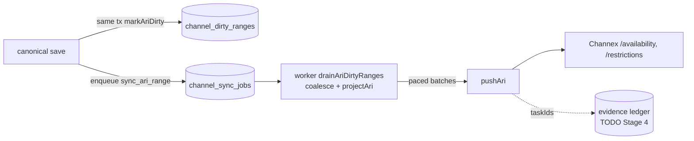

# Channex — ARI Sync Flow (outbound)

- **Status:** Skeleton — Stage 1; completed in **Stage 4**
- **Date:** 2026-07-18
- **Branch:** `feat/pms-hardening-channex-certification`
- **Sources:** `docs/audit/WORKFLOW_INVENTORY.md` (§11, §12), `docs/audit/CHANNEX_CERTIFICATION_MAPPING.md` (§1), ADR-0004

The outbound availability/rates/restrictions flow: from a canonical save to a Channex API call, incremental drain and Full Sync.

## Current state

Every canonical write calls `markAriDirty` (`src/lib/channel/outbox.ts:41`) in the same transaction — no-op with no active outbound connection; coalesces overlapping/adjacent pending ranges per (connection, room, kind, plan-scope); enqueues ONE deduplicated `sync_ari_range` job (`WORKFLOW_INVENTORY.md` §12). The worker gates on `active AND outbound_sync_enabled AND full_sync_required=false`, then `drainAriDirtyRanges` selects ≤500 due ranges ordered by revision, unions spans, runs the canonical `projectAri` projection (shared verbatim with the pricing engine), and sends paced `pushAri` batches. Full Sync is operator-only from `/channels`, runs `runInitialFullSync` in phases with persisted milestone progress, paces ~6.5 s between requests (10/min/property budget, ≤6 batches/kind), and dead-letters on any failure rather than auto-retrying (`WORKFLOW_INVENTORY.md` §11). Ranges succeed → `synced`; on failure `failRanges` applies bounded exponential backoff until `max_attempts=5` then `status='failed'` (a silent-stale dead range, no requeue — F5).

Certification-relevant gaps: incremental drains discard Task IDs (G1); no per-request evidence ledger (G2); 429 uses generic backoff, retrying too fast (G3); outbound hardcodes the staging base URL (G6).

## Target state (per ADR-0004)

- Batching/coalescing stays in the drain (one `POST /availability` + one restrictions call where values fit 10 MB) — the property that makes tests 3–8 emit "1 API call".
- Persist `SendOutcome.taskIds` per push into the evidence ledger (G1/G2).
- 429 cooldown + circuit breaker on the connection (G3).
- Environment routing from `channel_connections.environment` (G6).
- Dead-range requeue surface (Stage 3/Stage 6 observability).

## To be completed in Stage 4

- [ ] Producer→outbox→queue→drain→pushAri sequence with the batching/coalescing rule.
- [ ] Full Sync phase diagram + request-count assertion (G5).
- [ ] Evidence-capture points (Task IDs, value counts, payload hash).
- [ ] 429/circuit-breaker state machine.
- [ ] Mermaid ARI-sync diagram (replace seed).

