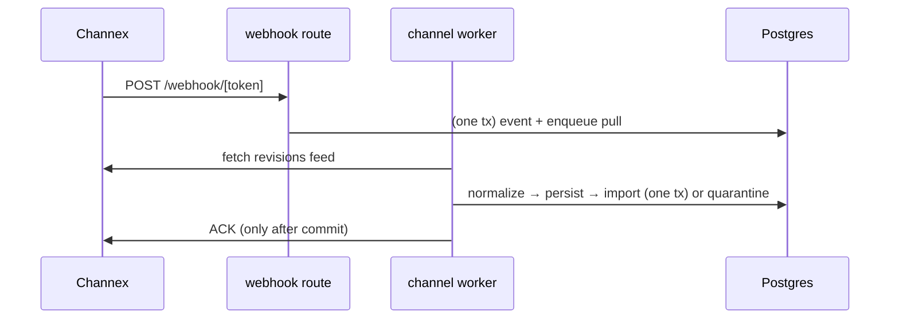

# Channex — Booking Revision Flow (inbound)

- **Status:** Skeleton — Stage 1; completed in **Stage 4**
- **Date:** 2026-07-18
- **Branch:** `feat/pms-hardening-channex-certification`
- **Sources:** `docs/audit/WORKFLOW_INVENTORY.md` (§2, §13, §14), `docs/audit/RESERVATIONS_INVENTORY_AUDIT.md` (§1.6, §2 Q4), `docs/channex/PMS_CERTIFICATION_REQUIREMENTS.md` (§7)

The inbound booking-receiving flow: webhook → revision feed → normalize → apply → acknowledge, with the quarantine and polling-fallback branches.

## Current state

Inbound is LIVE (BDC). The webhook `POST /api/channel/webhook/[token]` authenticates via a hashed opaque token (active + inbound-enabled only, else 404), rate-limits, caps body to 256 KB, and in ONE transaction inserts a redacted `channel_webhook_events` row (dedup) + enqueues `pull_booking_revisions` (priority 20), NOTIFY on commit (`WORKFLOW_INVENTORY.md` §2). The worker's `runInboundPull` pages the **booking revisions feed** (never the plain bookings listing, per §7), and per revision: `normalizeBookingRevision` → `persistBookingRevision` (idempotent on `(connection, revision_id)`, PAN encrypted before redaction, CVV discarded) → `importRevisionRow` in one tx (`applyLiveRevision`: room resolution by external UUID only, `lockRooms` + `checkRoomAvailability`, `markRevisionImported` together) → **ACK only after commit**, with a re-ack sweep for ambiguous failures. Persist-then-quarantine guarantees nothing is lost when the feed expires (~30 min, D82). Duplicate prevention is DB-enforced by `uq_reservations_external_booking` (029). A 5-minute fallback poll (`ensureInboundPullJobs`) and a recovery-by-ID action cover missed webhooks (`WORKFLOW_INVENTORY.md` §13; `RESERVATIONS_INVENTORY_AUDIT.md` §1.6, F9 "exemplary").

Operational issues: quarantined revisions re-import every ~5-min poll writing a fresh error row each cycle (unbounded growth, OPS F2); no notification fires when a NEW quarantine appears — an OTA guest may arrive for a booking the calendar never showed (OPS §5); `channel_webhook_events.status` is written `'enqueued'` and never transitions (OPS F8).

## Target state (per PMS_CERTIFICATION_REQUIREMENTS.md §7, ADR-0004)

- Booking-receiving flow confirmed: create/modify/cancel + ACK; revisions feed only; polling fallback (test 11).
- Quarantine-logging dedup + retention (Stage 3 foundation).
- New-quarantine operator notification (Stage 3 sync alerting, `PMS_GAP_MATRIX.md` §16).
- Environment routing already honored on inbound; keep consistent with outbound after G6.

## To be completed in Stage 4

- [ ] Full inbound sequence (webhook + poll) with the quarantine branch.
- [ ] ACK-after-commit + re-ack sweep detail.
- [ ] Quarantine visibility + notification design.
- [ ] Test-11 evidence capture (booking IDs, screenshots).
- [ ] Mermaid booking-revision diagram (replace seed).

